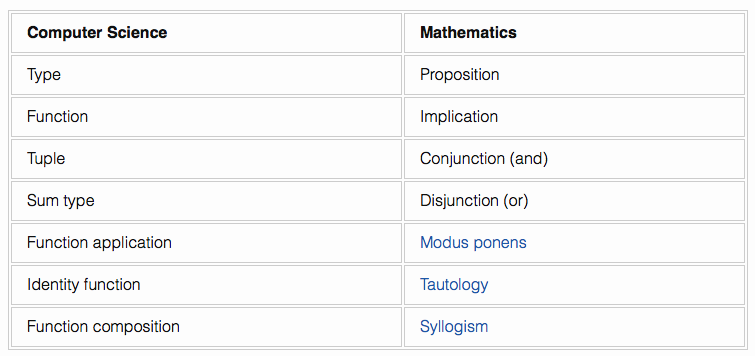

autoscale: true

# Proof in Functions

^ this is a more cerebral talk that may not affect your every day programming, but it's still fun to explore some mind-bending ideas.

---

# Brandon Williams

* @mbrandonw
* brandon@kickstarter.com

---

# iOS at **Kickstarter**


---

# iOS at **Kickstarter**


---

# Brandon Williams

* Went to grad school for math

---

# Brandon Williams

* Went to grad school for math
* Did the weird kind of math

---

# Swift Primer

^ the meat of this talk lives in a world independent of Swift, but we will use swift to explore the ideas since it is a highly relevant language right now and the playgrounds allow for some fun stuff

---

# Swift Primer

* Swift is a _strongly typed_ language

---

# Swift Primer

* Swift is a _strongly typed_ language
* Every variable must have a well-defined type associated, e.g.
  * `x: Int`
  * `name: String`
  * `xs: [Int]`

^ `[Int]` is syntatic sugar for array of integers

---

# Swift Primer

* Swift is a _strongly typed_ language
* Every variable must have a well-defined type associated, e.g.
  * `x: Int`
  * `name: String`
  * `xs: [Int]`
* Inspired by many languages, but readable if you know C

---

# Generics Primer

* A strongly typed language might seem restrictive

---

# Generics Primer

* A strongly typed language might seem restrictive
* Generics fix this

---

# Generics Primer

* A strongly typed language might seem restrictive
* Generics fix this
* They allow us to write functions that take and return values from a wide class of types.

---

# Array concat

```swift
func concat (xs: [Int], ys: [Int]) -> [Int] {
  // implementation
}
```

^
Break this down.
* `concat` is the name of the function
* `xs` and `ys` are parameters of the function
* `xs: [Int]` means "of type"
* `[Int]` is syntatic sugar for array of integers
* `->` return type is a `[Int]`

---

# Array concat

```swift
func concat (xs: [Int], ys: [Int]) -> [Int] {
  // implementation
}

func concat (xs: [String], ys: [String]) -> [String] {
  // implementation
}
```

^ Swift is smart enough to be able look at types and figure out which version of `concat` you plan on calling.

^ this makes strong types expressive

---

# Array concat

```swift
func concat (xs: [Int], ys: [Int]) -> [Int] {
  // implementation
}

func concat (xs: [String], ys: [String]) -> [String] {
  // implementation
}

func concat (xs: [User], ys: [User]) -> [User] {
  // implementation
}
```

^ at this point you have to step back and say there is a better way. generics allow us to write this for a more general situation.

---

# Array concat

```swift
func concat <A> (xs: [A], ys: [A]) -> [A] {
  // implementation
}

concat([2, 3, 5, 7], [11, 13, 17])
concat(["foo", "bar"], ["baz", "qux"])
```

^ `<A>` is the annotation that we want `A` to stand in for ANY type
^ We can even put some conditions on `A` so that we know a little more about `A`, e.g. equatable, comparable, ...

---

# `map`, `filter`, ...

```swift
func map <A, B> (xs: [A], f: A -> B) -> [B]

func filter <A> (xs: [A], p: A -> Bool) -> [A]
```

---

# Generics Primer

Generics also allow new types to be parameterized over any other type:

```swift
struct Pair <A, B> {
  let fst: A
  let snd: B
}


let value = Pair(fst: 3, snd: "howdy")
value.fst
value.snd
```

^ break this down
* A struct creates a new type out of existing types.

---

# Generics Primer

Generics also allow new types to be parameterized over any other type:

```swift
enum Optional <T> {
  case None
  case Some(T)
}

let three = Optional.Some(3)
let nothing = Optional<Int>.None
```

---

# Playground coding

---

# What is going on?

* Why do some functions have a unique implementation?

---

# What is going on?

* Why do some functions have a unique implementation?
* Why do some functions have *no* implementation?

---

# Propositional Logic

---

# Propositional Logic

* Made of propositions: $$P, Q, R, \ldots$$

---

# Propositional Logic

* Made of propositions: $$P, Q, R, \ldots$$
* Propositions can be true ($$\top$$) or false ($$\bot$$)

---

# Propositional Logic

* Made of propositions: $$P, Q, R, \ldots$$
* Propositions can be true ($$\top$$) or false ($$\bot$$)
* Propositions can be combined to form compound statements
  * $$P \land Q$$ = “$$P$$ and $$Q$$”
  * $$P \lor Q$$ = “$$P$$ or $$Q$$”
  * $$\lnot P$$ = “not $$P$$”

---

# Propositional Logic

* Implication (if/then) is also an operator

---

# Propositional Logic

* Implication (if/then) is also an operator
* $$P \Rightarrow Q$$: “if $$P$$ is true, then $$Q$$ is true”

---

# Propositional Logic

* Implication (if/then) is also an operator
* $$P \Rightarrow Q$$: “if $$P$$ is true, then $$Q$$ is true”
* For example:
  * $$P$$ = $$n$$ is odd
  * $$Q$$ = $$n+1$$ is even
  * $$P \Rightarrow Q$$

---

# Propositional Logic

* Implication (if/then) is also an operator
* $$P \Rightarrow Q$$: “if $$P$$ is true, then $$Q$$ is true”
* Another example
  * $$P$$ = $$n$$ is prime
  * $$Q$$ = $$n+2$$ is prime
  * $$P \Rightarrow Q$$

---

# Propositional Logic

Examples of compound statements:

* $$P \Rightarrow P$$

---

# Propositional Logic

Examples of compound statements:

* $$P \Rightarrow P$$
* $$P \land Q \Rightarrow P$$

---

# Propositional Logic

Examples of compound statements:

* $$P \Rightarrow P$$
* $$P \land Q \Rightarrow P$$
* $$P \Rightarrow P \lor Q$$

---

# Propositional Logic

Examples of compound statements:

* $$P \Rightarrow P$$
* $$P \land Q \Rightarrow P$$
* $$P \Rightarrow P \lor Q$$
* $$((P \Rightarrow Q) \land (Q \Rightarrow R)) \Rightarrow (P \Rightarrow R)$$

^ if you squint, the shapes of these forms look very similar to something we already saw

---

# Similar Shapes

* $$P \Rightarrow P$$

---

# Similar Shapes

* $$P \Rightarrow P$$

* `(x: A) -> A`

---

# Similar Shapes

* $$P \land Q \Rightarrow P$$

---

# Similar Shapes

* $$P \land Q \Rightarrow P$$

* `(x: A, y: B) -> A`

---

# Similar Shapes

* $$P \Rightarrow P \lor Q$$

---

# Similar Shapes

* $$P \Rightarrow P \lor Q$$

* `(x: A) -> Or<A, B>`

---

# Similar Shapes

* $$((P \Rightarrow Q) \land (Q \Rightarrow R)) \Rightarrow (P \Rightarrow R)$$

---

# Similar Shapes

* $$((P \Rightarrow Q) \land (Q \Rightarrow R)) \Rightarrow (P \Rightarrow R)$$

* `(g: A -> B, h: B -> C) -> A -> C`

^ we replace propositions with types and implication with function arrows

---

# Curry-Howard Correspondence

^ first observed by the mathematician Haskell Curry in 1934 and later finished by logician William Howard in 1969.

---

# Curry-Howard Correspondence

* One-to-one correspondence between functions and theorems

---

# Curry-Howard Correspondence

* One-to-one correspondence between functions and theorems
* A function that typechecks proves a theorem

---

# Clarity

^ the curry howard correspondence finally gives us clarity on what is going on. it explains why some functions could be implemented and why others could not.

---

# Clarity

* Why couldn’t `f: A -> B` be implemented?

---

# Clarity

* Why couldn’t `f: A -> B` be implemented?
* Because then the proposition $$P \Rightarrow Q$$ would be true

---

# Clarity

* Why couldn’t `f: A -> B` be implemented?
* Because then the proposition $$P \Rightarrow Q$$ would be true
* That means any proposition implies any other proposition

---

# Clarity

* Why couldn’t `f: A -> B` be implemented?
* Because then the proposition $$P \Rightarrow Q$$ would be true
* That means any proposition implies any other proposition
* Clearly that’s absurd

---

# De Morgan's Law

$$
\lnot (P \lor Q) \Longleftrightarrow \lnot P \land \lnot Q
$$

^ We can prove more interesting theorems in Swift. Though this is pretty much the most interesting.

^ This law can be useful in practice for simplifying gnarly if conditionals

---

# The Atomic Objects

How to represent the pieces in Swift?

> $$P, Q, \Leftrightarrow, \lor, \land, \lnot$$

---

# How to model $$\lnot P$$

* The type that represents $$\bot$$

```swift
enum False {
}
```

^ first we model false

---

# How to model $$\lnot P$$

* The type that represents $$\bot$$

```swift
enum False {
}
```

* The only proposition $$P$$ for which $$P \Rightarrow \bot$$ is $$P = \bot$$.

---

# How to model $$\lnot P$$

* The type that represents $$\bot$$

```swift
enum False {
}
```

* The only proposition $$P$$ for which $$P \Rightarrow \bot$$ is $$P = \bot$$.
* Therefore we can model $$\lnot P$$ by:

```swift
struct Not <A> {
  let not: A -> False
}
```

---

# How to model $$\land$$

* We previously called this `Pair`
* But let’s be more explicit:

```swift
struct And <A, B> {
  let left: A
  let right: B
  init (_ left: A, _ right: B) {
    self.left = left
    self.right = right
  }
}
```

^ Initializer is an implementation detail

---

# How to model $$\lor$$

```swift
enum Or <A, B> {
  case Left(A)
  case Right(B)
}
```

---

# Playground coding

---

# De Morgan's Law

We’ve now given a computer proof of the law.

---

# De Morgan's Law

There’s a second (“dual”) version of the law:

$$
\lnot (P \land Q) \Longleftrightarrow \lnot P \lor \lnot Q
$$

---

# De Morgan's Law

There’s a second, “dual”, version of the law:

$$
\lnot (P \land Q) \Longleftrightarrow \lnot P \lor \lnot Q
$$

* A computer proof cannot be given of this law.

---

# De Morgan's Law

There’s a second (“dual”) version of the law:

$$
\lnot (P \land Q) \Longleftrightarrow \lnot P \lor \lnot Q
$$

* A computer proof cannot be given of this law.
* Nor can one prove $$\lnot(\lnot P) \Rightarrow P$$

---

# Why?

---

# Why?

* Classical versus Constructive (Intuitionistic) logic

---

# Why?

* Classical versus Constructive (Intuitionistic) logic
* Classical: every proposition is either true or false.

---

# Why?

* Classical versus Constructive (Intuitionistic) logic
* Classical: every proposition is either true or false.
* Constructive: it’s complicated.

---

# Why?

* Classical versus Constructive (Intuitionistic) logic
* Classical: every proposition is either true or false.
* Constructive: it’s complicated.
  * or: a proposition is true only when it is proven true.

---

# Curry-Howard Correspondence



---

# Exercise

Implement the following function:

```swift
func f <A> (x: A) -> Not<Not<A>> {
  ???
}
```

This proves the theorem: $$P \Rightarrow \lnot(\lnot P)$$

---

# If you liked this...

## [http://www.fewbutripe.com](http://www.fewbutripe.com)

* @mbrandonw
* brandon@kickstarter.com
