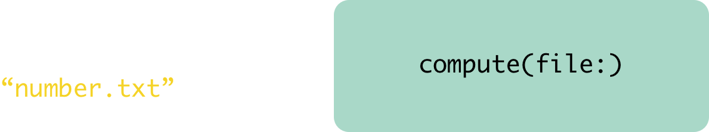
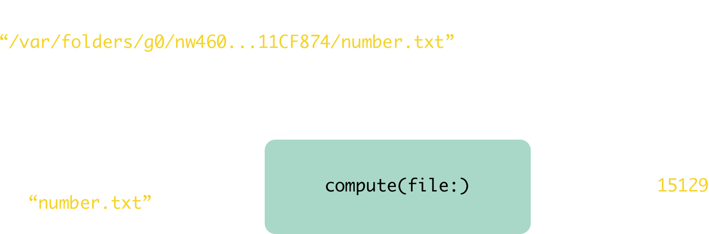
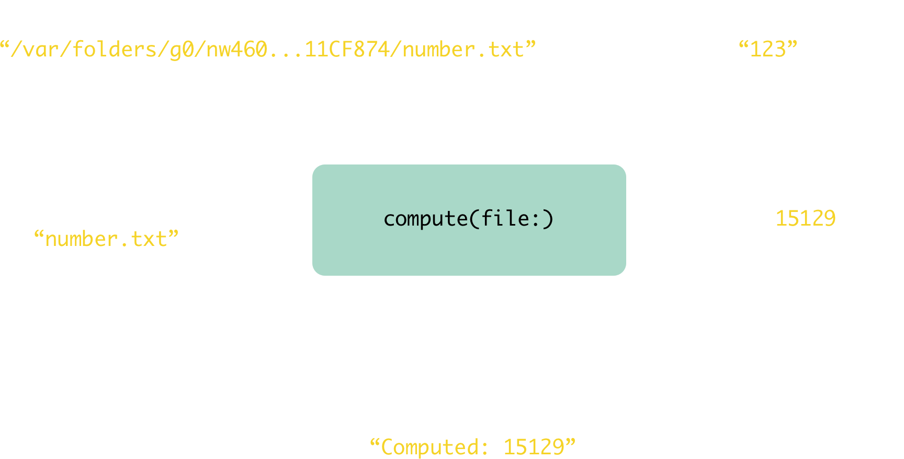

build-lists: true

---

## The Two Sides of Testing

^ Today I'm going to talk a lot about testing. We're going to dive deeply into why we want to test, and what it takes to write testable code. It turns out there are two precise things that prevent code from be testable, and in a certain sense they are "dual" versions of each other. All questions of testability come down to understanding these two sides.

^ We'll also describe some ways to make code more testable by taking inspiration from functional languages such as Haskell.

^ Everything I'm going to talk about are real things that me and my colleagues use everyday, and you can see all of these ideas in our recently open sourced code.

---

# Brandon Williams
* brandon@kickstarter.com
* @mbrandonw
* github.com/kickstarter/ios-oss

^ Here's some contact info if anyone wants to get in touch with me later.

---

## Why test?

^ I unfortunately don't have a great pitch as to why you should test. I can (and will) describe some of the many ways that testing has saved me and my colleagues in our every day work, but somehow that kind of stuff doesn't usually convince people.

^ Instead I'm mostly going to focus on how testing has completely transformed the way I write code. I now write code only if it can be tested. It is a great boundary for me so that I can force myself to write my code in a functional programming style. I also have slowly started to consider my test code as the most important work I do, not the implementation. The test code is where I truly document how I expect my application to work, and it is where I have thought through edge cases and subtleties.

---

## A case study

^ Let's analyze a seemingly innocent function and see what makes it difficult to test.

---

```swift
/**
 * Reads a number from a file on disk, performs a computation,
 prints the result to the console, and returns the result.
 */
func compute(file: String) -> Int {


`
```

^
First the description and signature of the function: The function is called `compute`, and it takes a string and it returns an integer. The function is supposed to read a file from the disk, try to interpret the contents of that file as a number, perform some computation on that number, print the result to the console, and finally return the result. It's important to note that we are considering the fact that it prints something to the console as a requirement of the feature, not merely something we are doing for debugging purposes.
We can implement this function pretty easily...

---

```swift
/**
 * Reads a number from a file on disk, performs a computation,
 prints the result to the console, and returns the result.
 */
func compute(file: String) -> Int {

  let value = Bundle.main.path(forResource: file, ofType: nil)
    .flatMap { try? String(contentsOfFile: $0) }
    .flatMap { Int($0) }
    ?? 0

  let result = value * value

  print("Computed: \(result)")

  return result
}
```

^
Stepping through this:
* First we use the `Bundle` to find the full path to the file on disk.
* Then we try initializing a string with the contents of the file.
* Then we try to convert that string to an integer.
* Then we coalesce to `0` in case any of the previous steps failed.
* Then we square the integer.
* Then we print a message to the console.
* And finally we return the result.

---

```swift
/**
 * Reads a number from a file on disk, performs a computation,
 prints the result to the console, and returns the result.
 */
func compute(file: String) -> Int {

  let value = Bundle.main.path(forResource: file, ofType: nil)  // "/var/.../number.txt"
    .flatMap { try? String(contentsOfFile: $0) }                // "123"
    .flatMap { Int($0) }                                        // 123
    ?? 0                                                        // 123

  let result = value * value                                    // 15129

  print("Computed: \(result)")                                  // "Computed: 15129\n"

  return result                                                 // 15129
}

compute(file: "number.txt")                                     // 15129
```

^
Let's step through this code with a particular invocation.
* We plug in `number.txt` into the function
* It finds the path to the file `/var/folders/.../number.txt`
* It reads the string ``"123"`` from the file
* It converts the string to the number `123`
* It squares the number
* It prints a message to the console
* It returns `15129`
This function isn't so complicated, and we've probably all written code like this before. Maybe you didn't read from the disk, but maybe you read from a cache, or user defaults, or a singleton, etc...
However, it has some serious shortcomings when it comes to testing it. Let's look deeper at that.

---


^
Here is our function. It needs some input in order to do it's job. In this case, it needs a string that is the name of the file which it is supposed to read.

---



^
We denote this as an arrow pointing into the function.
It returns some output.

---


^
We denote this as an arrow leaving the function.
This seems simple enough.
But, there's more to the story. In order for this function to do its job, it needed more than just the input of `number.txt`. For one thing, we had to access this global function...

---



^
`Bundle.main.path(forResource:ofType)` in order to figure out the full path of where the file is located on disk.
From that function you get this long path string
`/var/folders/g0/.../number..txt`, and we have no idea how that function is supposed to work.
Also we have this other global function...

---


^
`String(contentsOfFile:)`. It somehow reads the contents of the file. It's a function whose output depends on the current state of your entire hard drive: sometimes it can read the file (e.g. when the file is actually there) and sometimes it cannot (e.g. when the file is missing).
We denote these two global things as arrows pointing down into the function. We do this because these global things are like hidden inputs of the function that you didn't realize your function depended on.
The fact that this function was not given everything it needed to do its job is not its only problem. The execution of this function also changed the state of the world!

---



^
When this function is executed it prints a message to the console, and that action is not accounted for at all in the return type. No one would know that the function does this unless we happen to be inspecting the console.
We denote this by an arrow pointing down from the function. We do this because it's like an additional output of the function.
This picture describes why it is so difficult to test this function. It seemed like it was a simple function that took a string as input and returned an integer, but secretly it depended on the state of your hard drive at the time it was executed and altered the state of your computer by print a message to the console.
In order to test this function you must be able to place a file in a very specific location (but good luck knowing where considering that `path(forResource:ofType:)` is a total black box), and you have to be able to confirm that a message was logged to a console but that _nothing_ else changed! That's tough!

---


^
This picture shows the two sides to testing. You have the inputs, both the explicit and implicit, and you have the outputs, both the explicit and implicit. It is crucial to understand these sides fully in order to write testable code.
So let's do that.

---

## Testing output

^
We'll start with the output side. This in some sense the easiest side to understand because it is very familiar to us.

---

#### Testing output

## Side effects

^
The thing that makes testing output difficult is side effects. First, a definition of side effects.

---

# Side effects

An expression is said to have a “side effect” if its execution makes an observable change to the outside world.

---

### How do you test code with side effects?

^ In order to test a function that has a side effect, you must execute the function, and then make assertions on the state of the world after executing. You can confirm that the side effect that you wanted to happen did indeed happen, but you can never be sure that there were not additional side effects that accidentally happened.

---

### A better way to handle side effects

---

## A better way to handle side effects

Try to _describe_ effects as much as possible without actually performing the effects.

^
That is, treat the effects as data, then you can make assertions on them as you would on the output of a function.
This goes into a very deep topic of managing side effects. The idea is that you push doing side effects to the boundary of your code. You continue building up data descriptions of the side effects, and then at the last moment you have a naive "interpreter" layer that can very simply perform the side effect.

---

## A better way to handle side effects

```swift
func compute(file: String) -> (Int, String) {

  let value = Bundle.main.path(forResource: file, ofType: nil)
    .flatMap { try? String(contentsOfFile: $0) }
    .flatMap { Int($0) }
    ?? 0

  let result = value * value

  return (result, "Computed: \(result)")
}
```

^
For example, going back to our `compute` function, we can get rid of the `print` statement by instead altering the return value to account for the `String` message that should be logged to the console. Now we are describing what we want done, but not actually doing it.
Changing the return value is of course a big deal. It means now this function won't compose nicely with other functions that take `Int` as an argument. But, it's for good reason. Breaking that composition means we now have to think about how the side effect of logging a console message propagates through a chain of data transformations. In fact, a deep study of how to handle that would naturally lead you to rediscovering monads!

---

## Testing Input

^
So we have now talked about testing the output side of a function. It involves not only testing what the function returned, but also what side effects it performed.
The other side of testing is testing the inputs. This means being able to fully control and sculpt what data you give the function in order to do its job.

---

#### Testing Input
## Co-effects

^
The thing that makes testing inputs difficult are co-effects! These are the globals that the function reached out to access. They are the things you had no control over when the function executed. You didn't get to specify which globals.

---

#### Testing Input
## Co-effects
### i.e. the “dual” of side effects

^
Notice the duality of these sides. Testing outputs means testing effects, and testing inputs means testing co-effects.
Now for a definition of co-effects like we did for side effects. Unfortunately I don't have a fantastic definition, so I'm going to start with an analogy.

---

# Co-effects

If an effect is a change to the outside world after executing an expression...

> ...then...

...a co-effect is the state of the world that the expression needs in order to execute.

^
This is also known as dependency injection!

---

# Co-effects

An expression is said to have a “co-effect” if it requires a particular state of the world in order to execute.

^
So, with that analogy this is how I would define co-effect loosely.

---

### How do you test code with co-effects?

^
Let's ask the same question we asked for side effects.
How do you test code with co-effects?
Well, it is very difficult. You need some way to stub out the global values so that you can control what the function sees when it executes.

---

### A better way to handle co-effects

^
In order to do this, we need a way to control co-effects.
Inspired by a talk that Colin Barrett gave at the Functional Swift Conference I co-organize with Chris Eidhof, you can simply embrace globals by stuffing them all into a single struct and forbidding access to any global unless it is through that struct.

---

```swift
struct Environment {

}
```

^
It starts with a simple struct. And then we start adding globals to it.

---

```swift
struct Environment {
  let apiService: ServiceProtocol
}
```

^
A canonical example of a global is an api service / layer that you use to get data from a server.

---

```swift
struct Environment {
  let apiService: ServiceProtocol
  let cookieStorage: HTTPCookieStorageProtocol
}
```

^
We have a few spots in our app where we read and write from the global cookie storage. That's a big co-effect that we want to be able to control.

---

```swift
struct Environment {
  let apiService: ServiceProtocol
  let cookieStorage: HTTPCookieStorageProtocol
  let currentUser: User?
}
```

^
The currently logged in user is a co-effect, and it can change during the lifecycle of the application.

---

```swift
struct Environment {
  let apiService: ServiceProtocol
  let cookieStorage: HTTPCookieStorageProtocol
  let currentUser: User?
  let dateType: DateProtocol.Type
}
```

^
It may not seem like it at first, but accessing `Date` is a huge co-effect. The initializer of `Date` that takes no arguments is not a pure function, as it returns a different value every time you call it (since time has changed). The fact is, if you use the initialize `Date()` anywhere in your code, then that code is no longer pure and testable. In order to control this we put a protocol in front of date and force ourselves to use that instead of `Date`.
Doing this has allowed us to write very subtle tests involving dates and time, and prevent getting failing tests when running code from different time zones or day light savings settings.

---

```swift
struct Environment {
  let apiService: ServiceProtocol
  let cookieStorage: HTTPCookieStorageProtocol
  let currentUser: User?
  let dateType: DateProtocol.Type
  let language: Language
}
```

^
We also extract out the language being rendered in the app because we want to be able to write tests for each language we support. In fact, every single screenshot test we have has a version for English, French, German and Spanish. This way we can see how long or short strings affect the interface, we can verify copy when new strings come in, and when we launch new languages we can instantly generate hundreds of screenshots to inspect.

---

```swift
struct Environment {
  let apiService: ServiceProtocol
  let cookieStorage: HTTPCookieStorageProtocol
  let currentUser: User?
  let dateType: DateProtocol.Type
  let language: Language
  let mainBundle: BundleProtocol
}
```

^
As we saw earlier, `Bundle` is a co-effect that can easily sneak into your code.

---

```swift
struct Environment {
  let apiService: ServiceProtocol
  let cookieStorage: HTTPCookieStorageProtocol
  let currentUser: User?
  let dateType: DateProtocol.Type
  let language: Language
  let mainBundle: BundleProtocol
  let reachability: SignalProducer<Reachability, NoError>
}
```

^
This is a fun one. The device's ability to make network calls is a co-effect that you want to be able to model so that you can write nuanced tests for various configurations. We happen to use ReactiveSwift to model this, but I'm sure there are other ways.
We recently used this to prevent automatic streaming of video over cellular data, and could write tests for that logic.

---

```swift
struct Environment {
  let apiService: ServiceProtocol
  let cookieStorage: HTTPCookieStorageProtocol
  let currentUser: User?
  let dateType: DateProtocol.Type
  let language: Language
  let mainBundle: BundleProtocol
  let reachability: SignalProducer<Reachability, NoError>
  let scheduler: DateSchedulerProtocol
}
```

^
Speaking of ReactiveSwift, when doing things with time in ReactiveSwift, for example delaying or debouncing a signal, you must specify a date scheduler to perform that work on. That is, of course, a co-effect, and by extracting it out we can write tests that control time. We can test very specific ways that time interweaves into our code.

---

```swift
struct Environment {
  let apiService: ServiceProtocol
  let cookieStorage: HTTPCookieStorageProtocol
  let currentUser: User?
  let dateType: DateProtocol.Type
  let language: Language
  let mainBundle: BundleProtocol
  let reachability: SignalProducer<Reachability, NoError>
  let scheduler: DateSchedulerProtocol
  let userDefaults: UserDefaultsProtocol
}
```

^
User defaults is of course a big co-effect.
The list goes on and on. We currently have 24 globals in our environment. I guess that could seem scary, but honestly it is very comforting to come to grips with the fact that some globals you simply cannot get rid of, and having them all in one place is very useful.

---

#### A better way to handle co-effects
## Refactor

^
Let's try refactoring our `compute` function so that it's free of co-effects. We are going to do this from first principles, not using the environment thing just described.

---

## Refactor

```swift
Bundle.main.path(forResource: file, ofType: nil)
```

^
Let's start with this global function call. We don't know what this function is doing, but all we really care about is that it either succeeded or failed (i.e. returns an optional). Those are the two cases we would want to be able to test.
To allow testing those cases we need to put a protocol in front of this function so that we can substitute in something we control.

---

## Refactor

```swift
protocol BundleProtocol {
  func path(forResource name: String?, ofType ext: String?) -> String?
}

extension Bundle: BundleProtocol {}
```

^
The protocol is simple, it just mimics the one function we need from a bundle. The `Bundle` class conforms to the protocol easily.

---

## Refactor

```swift
struct SuccessfulPathForResourceBundle: BundleProtocol {
  func path(forResource name: String?, ofType ext: String?) -> String? {
    return "a/path/to/a/file.txt"
  }
}

struct FailedPathForResourceBundle: BundleProtocol {
  func path(forResource name: String?, ofType ext: String?) -> String? {
    return nil
  }
}
```

^
We can then easily have two variants of a bundle that succeed or fail.

---

## Refactor

```swift
String(contentsOfFile: file)
```

^
Next we have this co-effect. Again, the only thing we really care about this is that it either succeeded in loading some specific string from the disk, or it threw an error.
We'll create a protocol to put in front of this. The fact that this function is an initializer of `String` makes things a little trickier, but it's still doable.

---

## Refactor

```swift
protocol ContentsOfFileProtocol {
  static func from(contentsOfFile file: String) throws -> String
}

extension String: ContentsOfFileProtocol {
  static func from(contentsOfFile file: String) throws -> String {
    return try String(contentsOfFile: file)
  }
}
```

^
We created a protocol that knows how to create a string from the contents of a file.

---

## Refactor

```swift
struct IntContentsOfFile: ContentsOfFileProtocol {
  static func from(contentsOfFile file: String) throws -> String {
    return "123"
  }
}

struct NonIntContentsOfFile: ContentsOfFileProtocol {
  static func from(contentsOfFile file: String) throws -> String {
    return "asdf"
  }
}

struct ThrowingContentsOfFile: ContentsOfFileProtocol {
  static func from(contentsOfFile file: String) throws -> String {
    throw SomeError()
  }
}
```

^
It's easy to make test conformances to this protocol that model the different cases we are interested in.

---

## Refactor

```swift
func compute(file: String,
             bundle: BundleProtocol = Bundle.main,
             contentsOfFileProtocol: ContentsOfFileProtocol.Type = String.self) -> (Int, String) {

  let value = bundle.path(forResource: file, ofType: nil)
    .flatMap { try? contentsOfFileProtocol.from(contentsOfFile: $0) }
    .flatMap { Int($0) }
    ?? 0

  let result = value * value

  return (result, "Computed: \(result)")
}
```

^
This is the final function refactor. It is a completely pure function, with all effects and co-effects removed, and every edge case can be tested. The added complexity in the function signature, both in the inputs and outputs, and now measures to how much effectual work the function is doing. It completely documents the types of effects that can be expected from this function. It's cumbersome, but rightfully so! The function is far more complicated than it seems at first.

---

## Conclusion

---

## Conclusion

The two things that make testing difficult are **effects** and **co-effects**.

---

## Conclusion

To tame **effects**, think of them as data in their own right, and you simply describe the effect rather than actually perform it.

A naive interpreter can perform the effects somewhere else.

---

## Conclusion

To tame **co-effects**, put them all in one big ole global struct, and don't ever access a global unless it is through that struct.

---

# Thanks

* brandon@kickstarter.com
* @mbrandonw
* github.com/kickstarter/ios-oss
