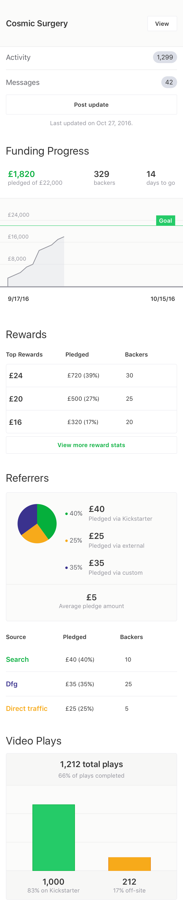
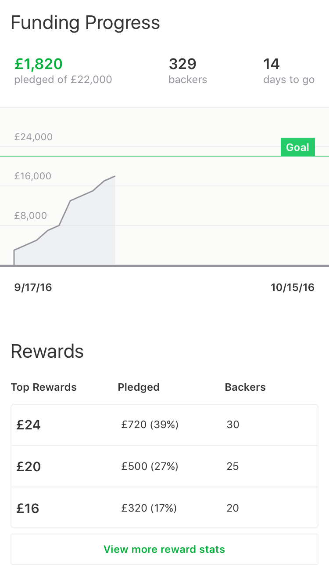
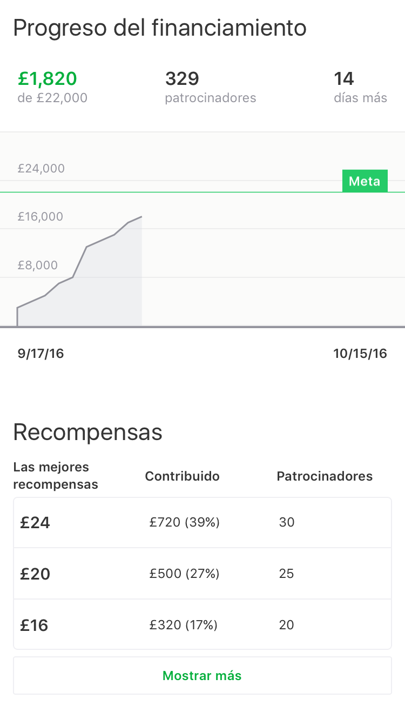
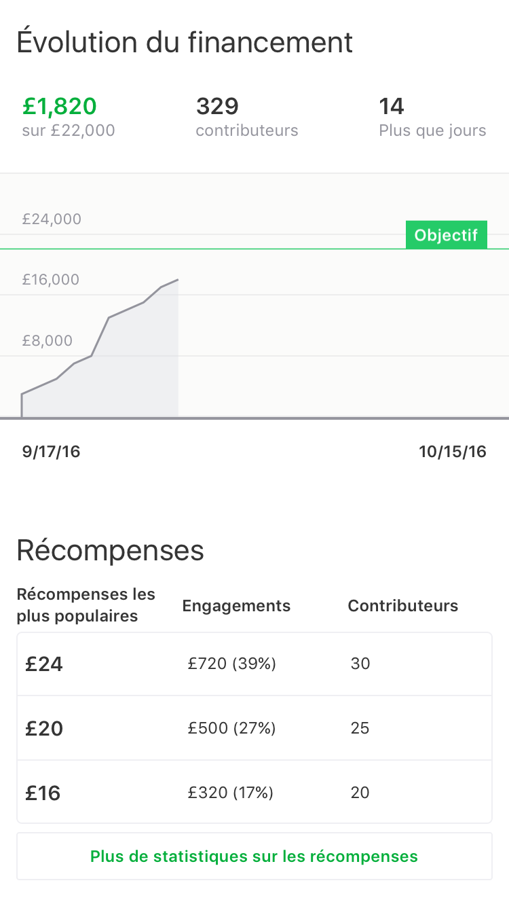
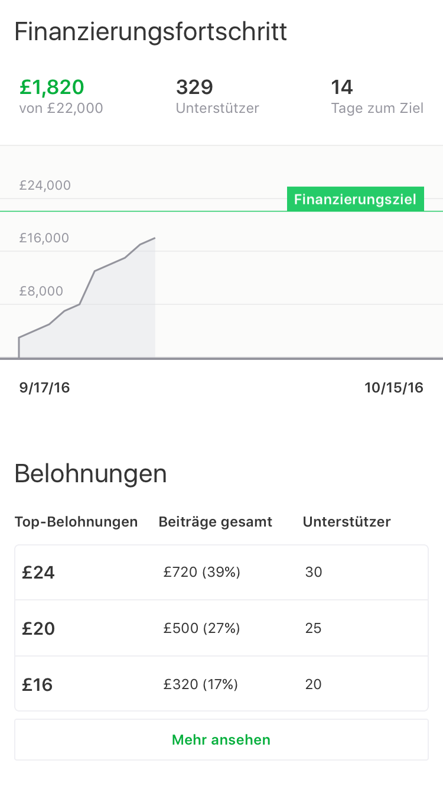
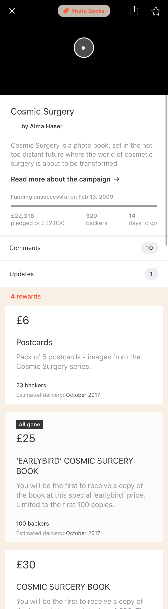

theme: Huerta, 1

# [fit] Testing at Kickstarter

* Brandon Williams
* @mbrandonw
* brandon@kickstarter.com

---

# [fit] We’re open source

* https://github.com/kickstarter/ios-oss
* https://github.com/kickstarter/android-oss

^ first things first, we’re open source so you can see everything i'm talking about

^ our android code is also open source and we do things basically the same over there

---
[.build-lists: true]

# Our setup

* Pretty vanilla setup
* Two targets
  * `Library.framework` for unit testable stuff (very fast)
  * `Kickstarter.framework` for UI testable stuff (pretty fast)
* No testing framework, just `XCTest`
* Continuous integration on CircleCI
  * https://circleci.com/gh/kickstarter/ios-oss

---

# Library.framework

```
Executed 1014 tests, with 0 failures (0 unexpected)
in 10.683 (11.762) seconds
```

---

# Kickstarter.framework

```
Executed 221 tests, with 0 failures (0 unexpected)
in 102.391 (102.641) seconds
```

^ 657 screenshots

---

# Screenshot testing

^ we can do every device

^ every orientation

^ every language

---



---



---



---



---



---


---


---


---


---


---


---


---


---


---


---



---

# [fit] How do we achieve this kind of testing?

---

# [fit] Functional Programming

---

"Join BuzzFeed for a night of shared grief and triumph around Mobile Application Testing. Experience speakers’ jubilation over successfully jumpstarting an Automated UI Testing suite. Cheer on their hard won victories in changing a team’s culture to value testing. And, finally, learn a few things about the current mobile testing landscape at the moderated panel."

A tour of how we do testing at Kickstarter using actual code from our recently open-sourced code base. We’ll see how we can apply the principles of functional programming and unit testing to get coverage on typically difficult subjects such as UI, 3rd party libraries and event tracking.
