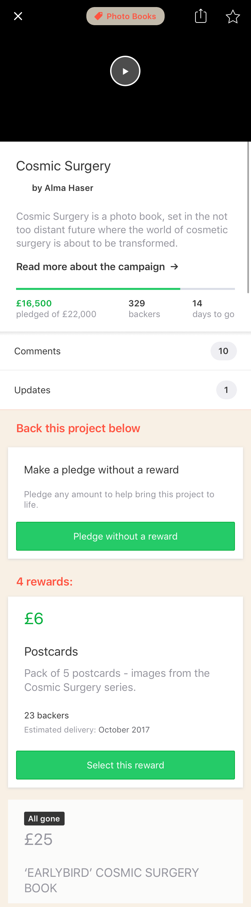
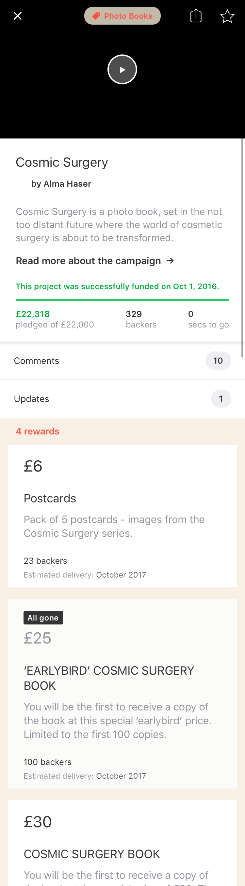
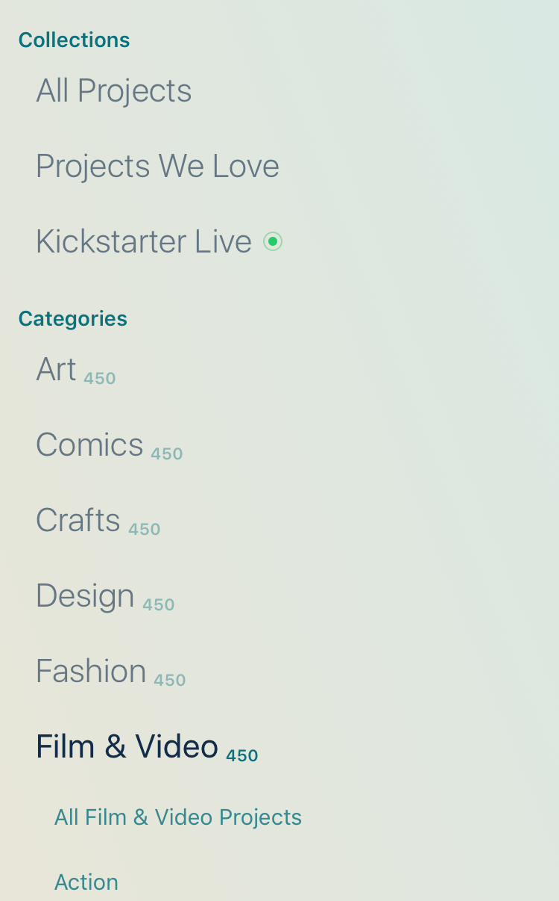
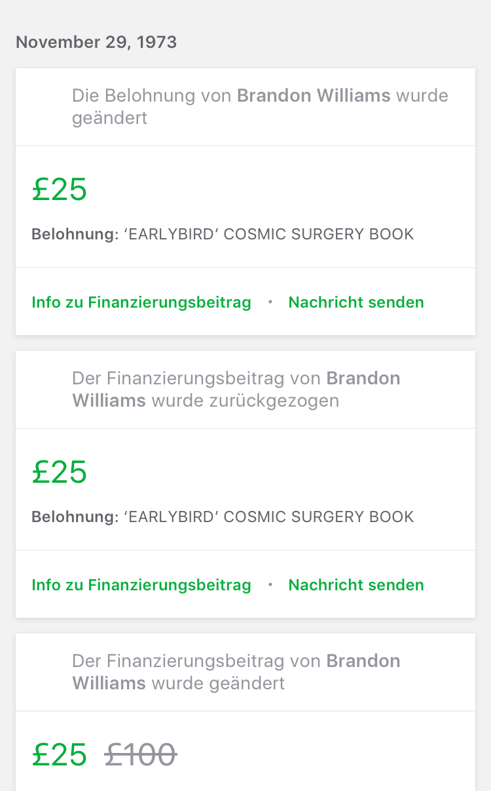
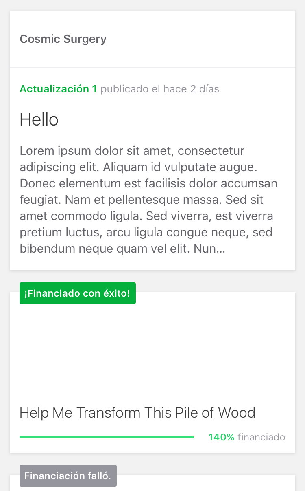

theme: Huerta, 2

---

# [fit] Testing at Kickstarter

* Brandon Williams
* brandon@kickstarter.com

---

# [fit] We’re open source

* https://github.com/kickstarter/ios-oss
* https://github.com/kickstarter/android-oss

^ first things first, we’re open source so you can see everything i'm talking about

^ our android code is also open source and we do things basically the same over there

---
[.build-lists: true]

# Our setup

* Pretty vanilla setup
* Two targets
  * `Library.framework` for unit testable stuff (very fast)
  * `Kickstarter.framework` for UI testable stuff (pretty fast)
* Plain `XCTest`
* Continuous integration with CircleCI
  * https://circleci.com/gh/kickstarter/ios-oss

---

# Library.framework

```
Executed 1030 tests, with 0 failures (0 unexpected)
in 10.683 (11.762) seconds
```

^ That's over a thousand test cases run in 10-11 seconds. 

^ The library framework contains all of our core logic. The majority of it is contained in something called a "ViewModel", but the name doesnt matter. It is simply a pure transformation of user actions into user observable outputs. we use reactive programming and so inputs and outputs are modeled as signals. 

^ it allows us to write very nuanced tests for flow, everything from sequence of user actions to sign up for an account, to a complicated apple pay flow

^ we can even write tests for event tracking so that we can prove that events track when we expect them to, and that we dont accidentally over track.

---

# Inputs
### (Reset password view)

```swift
func emailChanged(_ email: String?)
```

^ Describe all the different things a user can do in a view.

^ For example, in a reset password view there is an email text field that the user can change. everytime the user types a single character we will ping this input and it is lifted into a signal.

---

# Outputs
### (Reset password view)

```swift
var submitButtonEnabled: Signal<Bool, NoError>
```

^ then we describe all of the outputs the user can observe. in the case of the reset password form there is a simple output that determines if the submit button is enabled/disabled depending on whether the user has entered a valid email.

---

# Transform inputs to outputs
### (Reset password view)

```swift
submitButtonEnabled = emailChanged.map(isValid(email:)).skipRepeats()
```

---

```swift
func testSubmitButtonEnabled() {
}
```

^ how do we test this?

^ in our test cases we create a view model and hook up "test observers" to our outputs. these just let us inspect the whole history of values emitted by them.

---

```swift
func testSubmitButtonEnabled() {
  self.vm.inputs.viewDidLoad()

  self.submitButtonEnabled.assertValues([false])
}
```

^ viewdidload is kinda like a secret input lurking in the shadows. afterall a view does not load without some user action.

---

```swift
func testSubmitButtonEnabled() {
  self.vm.inputs.viewDidLoad()

  self.submitButtonEnabled.assertValues([false])

  self.vm.inputs.emailChanged("bad@email")

  self.submitButtonEnabled.assertValues([false])
}
```

---

```swift
func testSubmitButtonEnabled() {
  self.vm.inputs.viewDidLoad()

  self.submitButtonEnabled.assertValues([false])

  self.vm.inputs.emailChanged("bad@email")

  self.submitButtonEnabled.assertValues([false])

  self.vm.inputs.emailChanged("gina@kickstarter.com")

  self.submitButtonEnabled.assertValues([false, true])
}
```

---

```swift
func testSubmitButtonEnabled() {
  self.vm.inputs.viewDidLoad()

  self.submitButtonEnabled.assertValues([false])

  self.vm.inputs.emailChanged("bad@email")

  self.submitButtonEnabled.assertValues([false])

  self.vm.inputs.emailChanged("gina@kickstarter.com")

  self.submitButtonEnabled.assertValues([false, true])

  self.vm.inputs.emailChanged("gina@kickstarter")

  self.submitButtonEnabled.assertValues([false, true, false])
}
```

^ so that's our unit tests.

---

# Kickstarter.framework

```
Executed 221 tests, with 0 failures (0 unexpected)
in 102.391 (102.641) seconds
```

^ the most important tests in this framework are screenshot tests. luckily dustin already covered most of this so i can skip descirbing how it works.

^ instead i will say that one of the most important parts of being able to do these screenshots is extracting out all side effects from the views so that you can present them in isolation. you shouldnt be doing api calls, you shouldnt be reading stuff from disk, it shouldnt require building up a whole bunch of state in order to be able to instantiate a controller/view. ideally you just wanna give some data to the view and then render the view with that data.

^ this 221 tests currently generates 738 screenshots.

---


^ here's an example of a screenshot. this is the creator dashboard that our project creators can use. it shows a variety of stats.

^ we test lots of configurations and edge cases in our screenshots. for each screen and state we tend to do multiple devices (4in, 4.7in, ipad), every language we support (en, fr, es, de), and often landscape/portrait.

^ we even do tests for various accessibility features, like when voiceover is running and when the user has selected certain content size settings.

^ all of those things are possible because we extract out all of the effects.

^ we also generate some one-off screenshots of particular states that the designer is just interested in.

---


---


---


---


---


---


---


---


---


---


---


---


---


^ live project while a backer

---



^ live project while not a backer

---


^ successful project while a backer

---



^ successful project while not a backer

---


^ failed project

---


^ project with lives streams, in french, with a past/present/future live stream

---


^ live stream countdown on an ipad

---



^ these screenshots and the test suite as a whole is in my opinion the glue that holds all of engineering, design and product together for our small native apps team.

^ engineers get to implement new features and make deploys without fear of breaking other parts of the app. this can be particularly comforting to junior engineers and people new to the code base. just recently my colleague christella made some sweeping copy changes to the app, and numerous times she came to me to show that screenshots were showing some very long translations, and we were able to go back to the translators and get new strings.

^ designers have a living, breathing styleguide of their designs, and they can hold engineers accountable for seeing their vision through. further we can make subtle changes to our design language and generate all new screenshots so that she can go through with a fine toothed comb and verify, e.g., that some new colors didnt clash.

^ product managers can have proof that events are tracking in the way we think so that we can be confident in making business decisions from our data.

^ and lastly i would be remiss to not mention again that we do nearly all of the same stuff on android. my esteemed colleague lisa luo could have stood up here and basically gave the same talk. and in fact, of the four of us on the native team at kickstarter, three of us do ios and android because all of it is so similar.

---

# Thanks

* Brandon Williams
* @mbrandonw
* brandon@kickstarter.com
