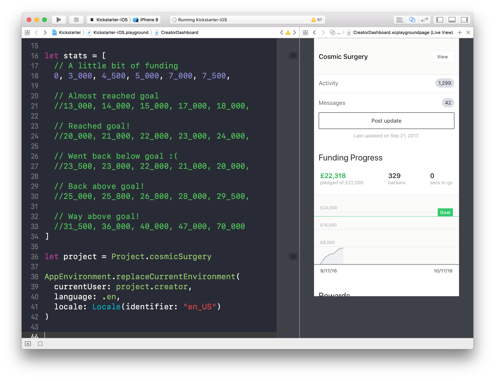
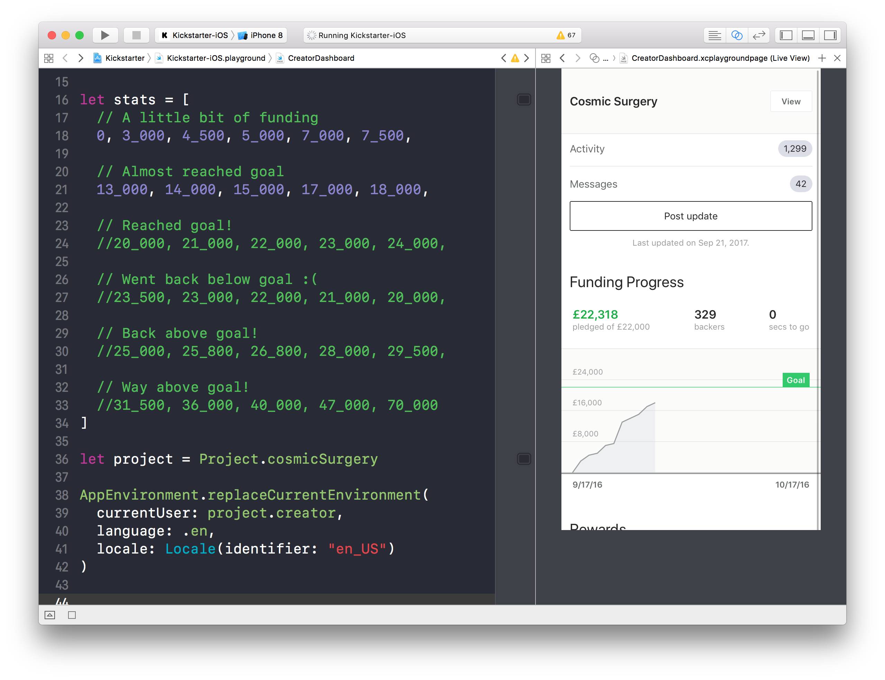
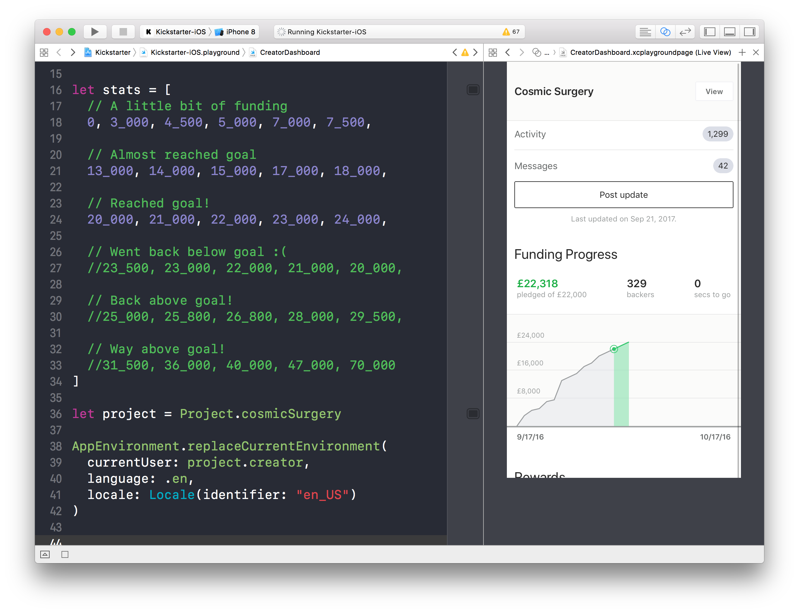
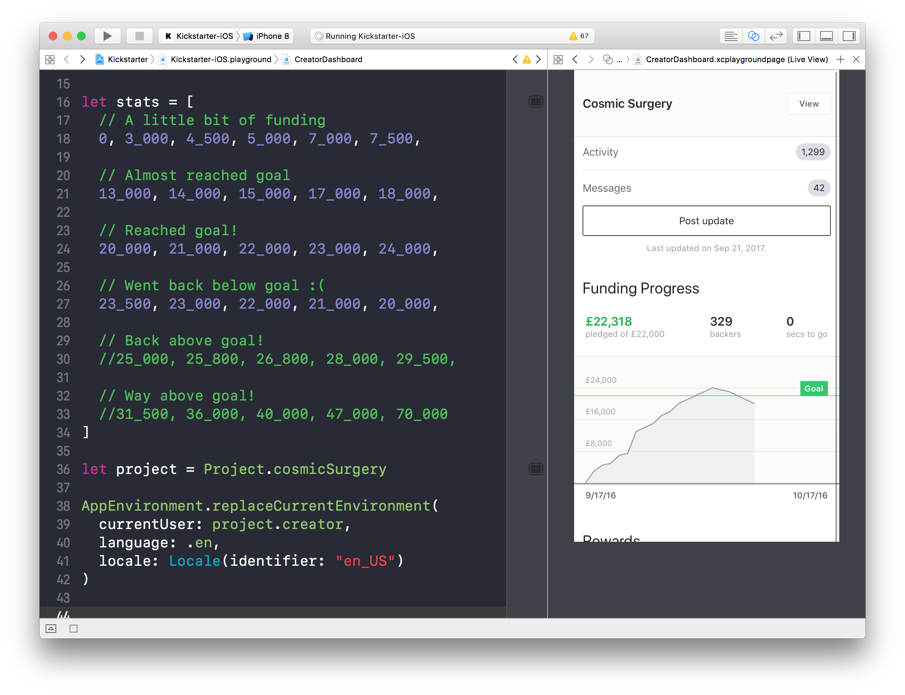
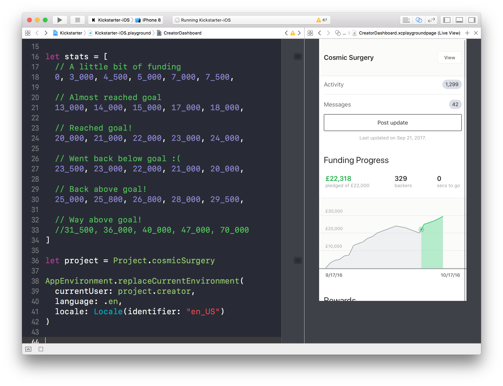
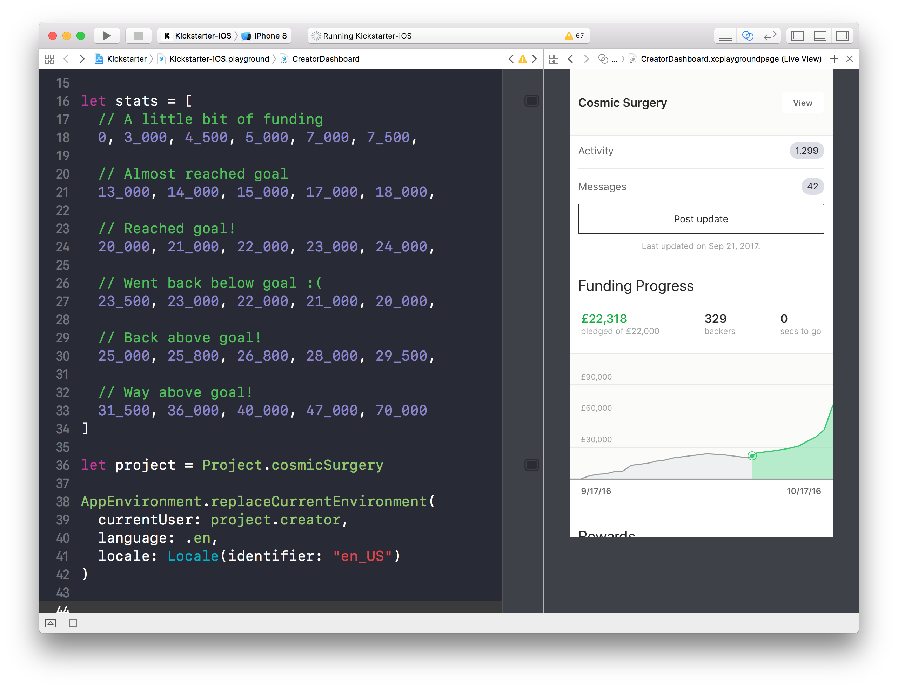
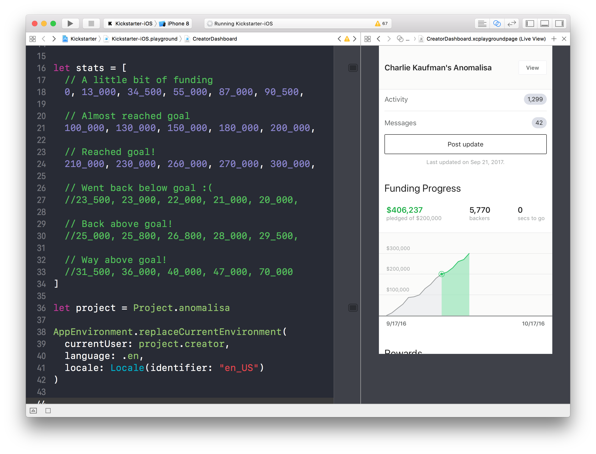
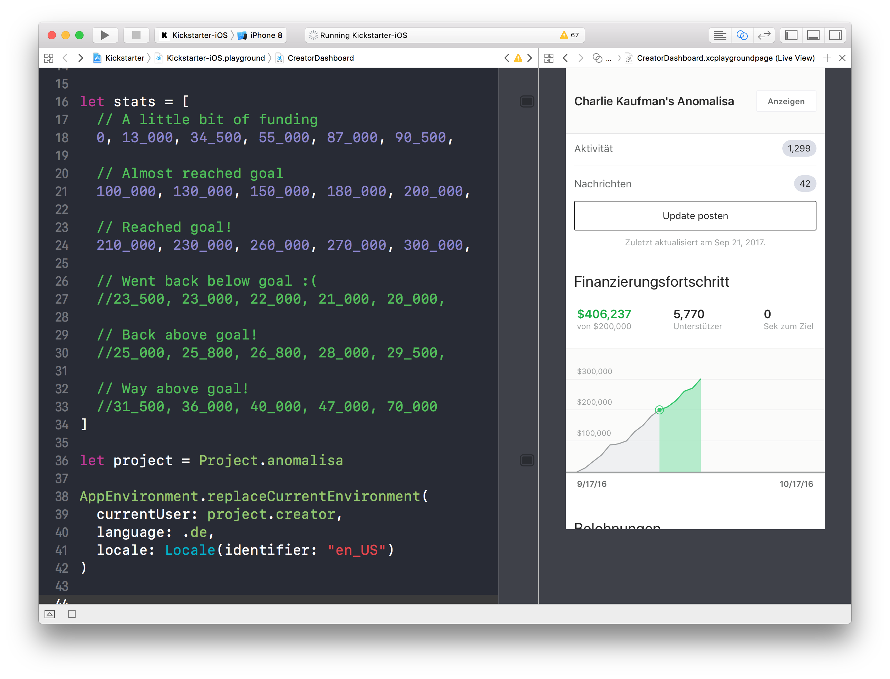
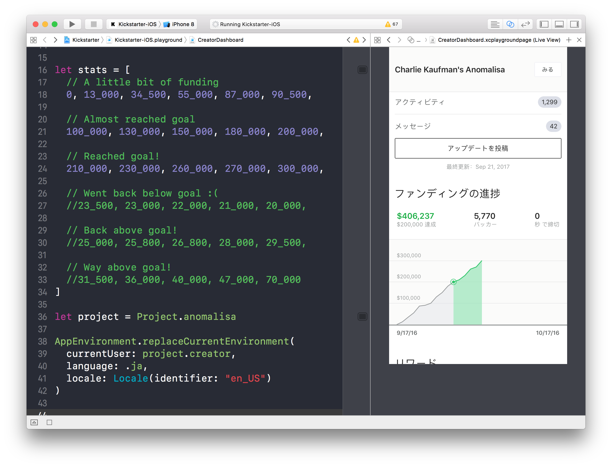
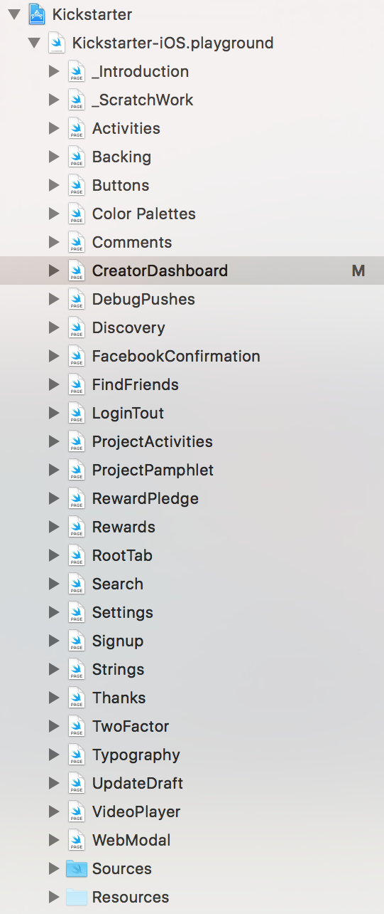

build-lists: true
theme: Fira, 4

# [fit] Playground Driven Development
#### Brandon Williams – @mbrandonw

^ intro 👋

^ a lot of the ideas show here were developed while i was at kickstarter

---

# [fit] What is “_____ Driven Development”?

^ it's just marketing. It's a way to make a development methodology seem very important, and tends to have a cultish aspect to it. you should always be skeptical when anyone is trying to push "___ drive development" on you.

^ Other examples "\_DD" are test driven development and type driven development.

^ i went for the catchier title because i believe a lot of people think playgrounds are just for scratch work to experiment with something, and i want to show it can be so much more.

^ What I mean by playground driven development is that you build your application by spending a large part of your time in playgrounds. in particular, the entire view layer can be built in playgrounds instead of storyboards/IB or constantly running the simulator. playgrounds provide a real development experience, not just used for one-off scratch work.

---

# [fit] An example from Kickstarter
#### https://www.github.com/kickstarter/ios-oss

^ we did this playground stuff a lot at kickstarter and so wanna start an example from that code base

^ and a reminder all of the code at kickstarter was open-sourced back in december, for both ios and android

---

^ here's one such playground. on the right you see the creator dashboard, the screen where creators could see top level stats of how their project is doing, view activity, send messages to backers, and post updates.

^ on the left is a small sample of all the things you can tweak to completely re-render the screen.

^ you can uncomment out some of these numbers to make the graph show more data

---

^ uncommenting line 21 makes some more data points come in

---

^ here i uncommented line 24 and a few more data points came in. in particular, the project is now over its funding goal so the graph changes slightly

---

^ uncommenting 27 shows what happens when the graph goes back below the goal

---

^ and then the graph goes back above the goal

---

^ and finally the last set of data points show what happens if we got hockey stick growth out of the graph

---

^ line 36 allows us to change what project is being represented in this playground. we had a bunch of hard coded values for particularly interesting projects that we could play with.

^ here i've brought in charlie kauffman's anomalisa

---

^ line 40 allows us to change the language the app is run in! here i've changed it to german

---

^ and then changed to spanish

---

^ then french of course

---

^ and finally japanese!

---

^ we had a bunch of these. nearly one for every screen in the app.

---
[.build-lists: false]

# [fit] Requirements

* Views can be isolated

^ to get to this you gotta take care of a few things first

^ Your views need to be able to operate when instantiated in isolation. Ideally, you can instantiate your controller by just giving it some data that it then uses to display it's UI

---
[.build-lists: false]

# [fit] Requirements

* Views can be isolated
* No side effects

^ You need to be able to control the side effects of your view. It must be possible to run a version of your view that does not make API requests, databases requests, track analytics, etc...

^ The reason is that you will be executing this code many times and it may not be proper to be doing all of those side effects many times. also you are going to want to control the results of those effects so that you can see the error states of your interface easily.

^ A popular way to handle this is with dependency injection, but there are also other ways.

---
[.build-lists: false]

# [fit] Requirements

* Views can be isolated
* No side effects
* App Framework

^ When you drag a playground into an Xcode project or workspace, it immediately gets access to all of the frameworks in that project/workspace. However, it does not get access to anything in the application target, the thing that is actually build into an IPA and installed on devices. So, if you want to experiment with this you have extract out all of the application code to another framework, you could just call it `AppFramework`. then your application target pretty much only contains the app delegate, and imports `AppFramework` so that you have access to all of that.

---
[.build-lists: false]

# [fit] Requirements

* Views can be isolated
* No side effects
* App Framework
* Handle bundles

^ Once you move everything to an additional framework, it all the sudden becomes important to know about bundles. I never really cared about em before this, I just always used `Bundle.main` and everything worked. Now, however, your assets, storyboards, XIBs are tied to a bundle that isnt the main one. It's easy to solve this, but you have to be aware of it.

---

# [fit] Pros

* Test in isolation
* Living documentation
* Control simulator settings better
* Works for macOS, iOS, tvOS and more
* Works with all Apple technologies

^ Playgrounds allow you to test your views in complete isolation. When you test in the simulator or device, you have to perform many steps to navigate to the screen you are interested in. that's a big cognitive load and you are likely to mess up steps after repeating it many times.

^ for example, that creator dashboard takes quite a few steps to get to since i have to be logged in as a creator of a project on kickstarter

^ Playgrounds becoming living documentation and style guide of your code base and application. Tests are for capturing nuanced logic in your application, playgrounds are for capturing broad visual styles and checking out different states. the playgrounds can also be structured as a lil mini tutorial on what the screen has to offer as we should in the creator dashboard

^ You can control things that are typically a bit of a pain in the simulator or a device. for example, you can easily bring up your controlling that operators in an environment where the size classes are regular by compact (so portrait on some devices), with preferred content size extra large, and perhaps layout direction that goes right to left.

^ You can easily switch between all 3 platforms, and i'm increasingly finding new ways to use playgrounds that dont necessarily fall into these 3 categories, more on that later.

^ Asset catalogue, storyboards, XIBs, prototype cells, ... A playground is just a lil mini simulator running in Xcode.

---

# Cons

* Playground stability
* Infrastructure investment

^ Playgrounds have had a complicated history when it comes to stability. There were even 3 releases, Xcode 8.0, 8.1 and 8.2 in which playgrounds simply did not work. Ever since Xcode 8.3 things have been better. If playgrounds were super stable i would have no problem selling this to you as a magical cure for creating UI's in swift/ios

^ it is a bit of an investment to get your views ready for playgrounds. i think that that work actually produces a better code base in general, separate from using playgrounds, so it's good overall. but it will take time to do, and maybe you dont wanna invest just yet.

^ I don't think it's a particularly risky investment. it does seem apple is giving playgrounds a lot of support, and hopefully they only get better.

---

# [fit] Live Demo

^ here's a simple interface i coded up in a playground. it's a counter app where +/- increment/decrement the counter, but each time you change the value an API request is made to wolfram alpha to check if the number is prime.

^ the stuff in `Hidden` doesnt matter for this talk, but it contains the architecture of this screen. it follows a basic elm/redux type pattern of having actions, state and reducer. i chose this for this demo cause it's simple, allows me to configure initial state, and with some work can easily control side effects.

^ `store` is what the controller communicates with to send actions and get state. and `startingCount` is just what the count label starts at.

^ [demo the app showing the API requests, and try the larger number]

^ [ put in the test store that isolates api requests ]

^ there's actually a logo image i have that we can plug into this.

^ Now a fun thing is that we can control trait environments here very easily. I have a helper called `playgroundController` that wraps my controller with a parent where the traits are overridden.

^ `playgroundController(for: Controller(), ...`

^ `preferredContentSizeCategory: .extraExtraExtraLarge`

^ can see we need to fix title wrapping

^ `layoutDirection: .rightToLeft`

^ finally, we can move the controller to our app framework and use it from here. when you make a change to the controller in the app framework you just hit cmd+B and then hop over to the playground.

---

^ and now for something really cool

^ lately i been doing a lot of server side swift, and i started to miss working in playgrounds. so wanted to see what i could do there.

^ you of course have the browser to test in, and things like curl and postman, but those are all interfaces on top of just plain request/response data. in that way they are kinda similar to storyboards and IB!

^ i wanted to be able to construct a request (url, method, headers, body), pipe it through my site middleware (which is response for...), and then render the resulting html into a web view.

^ some fun things to do:

^ add `/?launch-signup=1`

^ show site middleware

^ show http redirect

^ show pointfree.co redirect

^ add basic auth

^ do POST

---

## [fit] Next steps

* Screenshot testing
* Compile playgrounds in CI

^ Some things to explore once you have experimented with playgrounds for building apps.

^ Once you've take the time to make your views nice and isolated, there's nothing stopping you from doing screenshot testing! This is where during a unit test you load up a view, take a screenshot, and commit it to your repo. Then, at a later time if the test runs and a different screenshot is generated, you get a failed test.

^ Something I've personally never got working but really should have is to have your CI build the playgrounds. Since the playgrounds become an important part of your code's documentation, it's important to make sure they keep building. You dont wanna open a playground from a few months ago to find out it doesnt run and you have to fix a bunch of type errors.

---

#### Playground Driven Development
# [fit] Thanks!
#### Brandon Williams – @mbrandonw
#### https://github.com/mbrandonw/presentations
