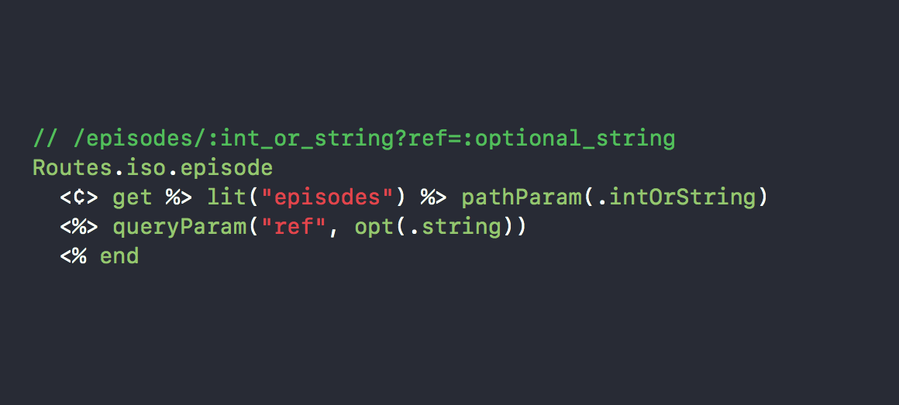
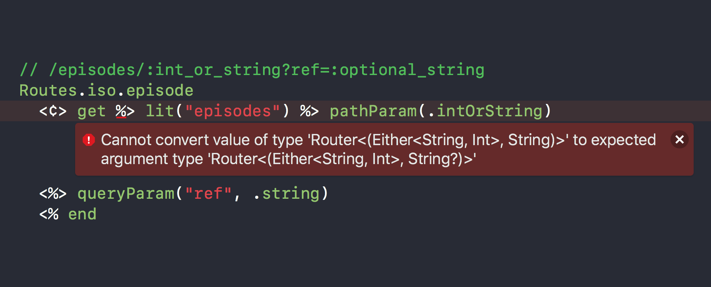
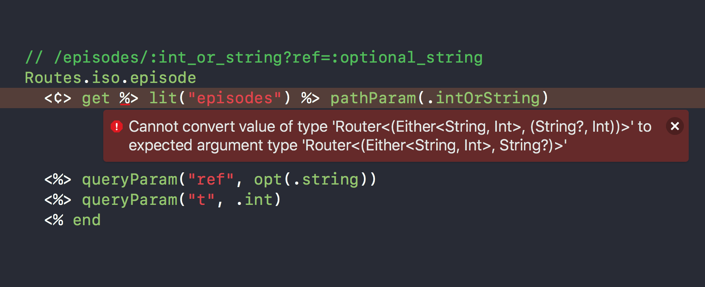
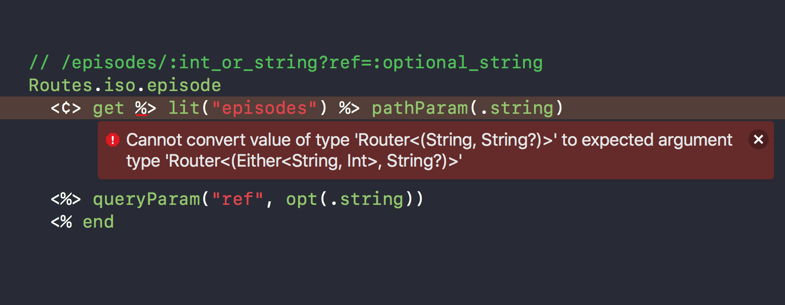
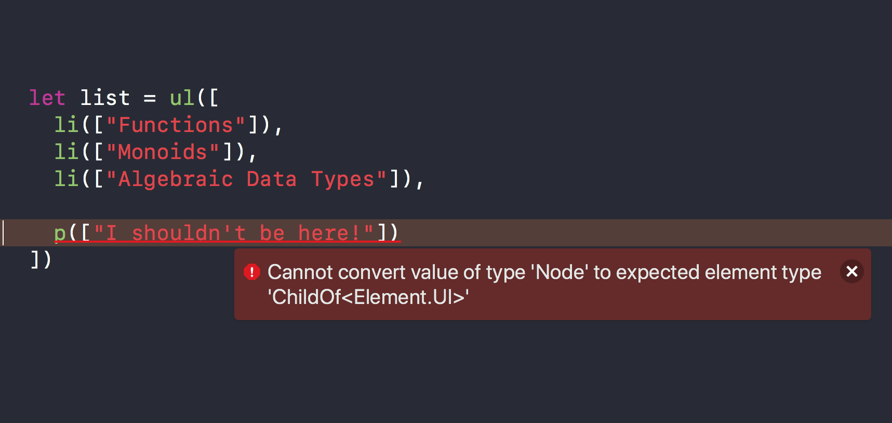
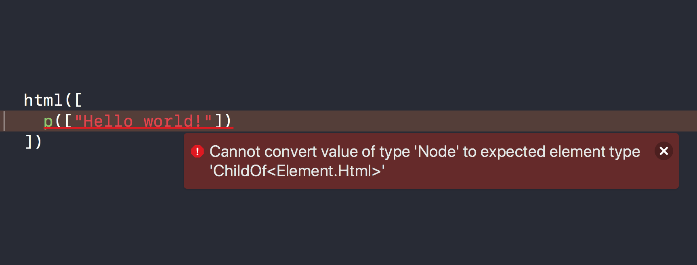
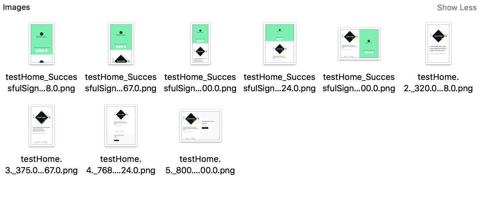

# [fit] Server-Side Swift from Scratch

* Brandon Williams

* @mbrandonw

* mbw234@gmail.com

^ Some of y'all may know me for having worked at Kickstarter, open sourcing our ios and android apps and doing a bunch of strange functional programming stuff. But, in my 5.5 years at Kickstarter I did a lot of backend work. in fact, still to this day i am the 4th top contributor to the web repo.

^ And today i wanna talk about some future directions of server-side swift that will make it state-of-the-art and ahead most other frameworks out there today. things that other frameworks can't even touch.

^ The backend at kickstarter was rails, and that informed a lot of what I thought a web framework was supposed to be like. I think there's a lot of really cool things about rails, some things I even steal directly from them, but swift's type system gives us an opportunity to rethink a lot of things, and we can get a much better server side framework in the long run. so i'd like to challenge some assumptions that we might have going into server side swift, and do some things from scratch

^ the stuff i'm going to show you today i find very exciting, and in fact is some of the coolest stuff I've worked on in awhile. there is so much to cover and there's no way we will have time to cover it all, so i'm going to be light on the details and give you a very quick overview of things i've been working on...

---

# [fit] Server-Side Swift from Scratch


In collaboration with:

* Stephen Celis

* @stephencelis

* stephencelis@gmail.com

^ first things first:

^ all the work i will be showing today has been a collaboration with my colleague Stephen Celis. so if you have any questions you can reach out to either one of us.

^ and the reason we got into this stuff is because we're working on a new project, called point-free.

---


^ we're creating a video series on swift and functional programming, and we wanted to build the site in server-side swift, so of course we would build a lot of stuff from scratch.

^ but the best part is everything i'm talking about today is open sourced.

---


<br><br><br><br><br><br><br><br><br><br><br><br><br><br><br><br><br><br><br><br><br><br><br><br><br><br><br><br><br><br><br><br><br><br><br><br><br>

> www.pointfree.co
> www.github.com/pointfreeco

^ everything we have done is completely open source. if you go to our github organization page you will find a bunch of repos and libraries that we have been working on. absolutely everything in this talk is somewhere there. in fact, the full source to the site is also on github.

---

# The layers of a web server framework

^ There are quite a few layers to a web server framework, and this talk is primarily concerned with only one slice of the full stack. So, to get us all on the same page I'm going to describe the layers a bit.

---
[.build-lists: true]

# Low-level layer

* Socket connections
* HTTP message parsing
* SSL
* Goal is to produce a `URLRequest`
  * `URL`, e.g. `https://www.pointfree.co/episodes/ep1-hello-world`
  * Method, e.g. `GET`
  * Post body of type `Data?`
  * Headers, e.g. `Accept-Language: en-US`

^ let's start with the low-level layer. this is the part i'm not really interested in cause they are all pretty much the same.

^ this is the layer responsible for doing socket connections and TCP, and HTTP parsing, and SSL, yada yada yada

^ The goal is to ultimately produce a `URLRequest` that can be given to the high-level framework where the real application work starts. that's the part we are interested in

---
[.build-lists: true]

# High-level layer

* Interprets the `URLRequest`
* Fetches needed data
* Renders a view
* Goal is to produce a `HTTPURLResponse`
  * Status code, e.g. `
    200 OK`, `302 FOUND`, `404 NOT FOUND`
  * Response headers, e.g.
    `Content-Type`, `Content-Length`, `Set-Cookie`
  * Response body of type `Data?`


^ Interprets the request: this means pick apart all the pieces of the request (url, method, body, headers) to figure out a code execution path to handle the request.

^ Fetch the data needed to build a response. This may mean hitting Postgres, Redis, memcached, loading something off disk, etc. No matter what it is, fetching this data is _always_ a side effect for it depends on the state of the outside world, and so this is perhaps the most complicated layer in the high-level.

^ Once the data is fetched it's time to render a view. This could be HTML, XML, JSON, plain text, raw data, etc.

^ The goal is to produce a `HTTPURLResponse` which consists of:

^ A status code

^ Some response headers

^ And some optional data. Certain types of responses dont have data, like a redirect.

---

<br><br><br><br><br><br><br><br><br><br><br><br><br>

# [fit] `(URLRequest) -> URLResponse`

^ So, on the high level, it is not unreasonable to say that a web server framework is nothing more but a function `(URLRequest) -> HTTPURLResponse`. In fact, thinking of it this way can be highly illuminating and expose a lot of wonderful compositions.

^ It's this level that I am most interested in and been doing a lot of work. My goal is to break up this function up into as many small, composable, understandable units as possible. Things like routing, data fetching, middleware, view rendering, etc... can be expressed as very simple pure functions. we are going to be taking a lot of inspiration from functional programming.

---
[.build-lists: true]

# [fit] `(URLRequest) -> URLResponse`

**Components**

* Middleware
* Routing
* Data fetching
* View rendering

^ I'll outline some of the components that go into this request-to-response lifecycle, and then we'll break down some of them in more detail in this talk.

^ First will be middleware. This is the fundamental unit of the composition in our request-to-response function.

^ Next is routing. It picks apart the request to create a first class value. A sufficiently advanced router should be capable of matching against any part of the request, including scheme, host, path, query params, HTTP method, post body, etc...

^ Fetching data, is where we go into side effect land, and making a nice story out of that is quite difficult. We won't be able to say much about that in this talk, but do know it's possible!

^ And then it's time to render the view. By this time we have gathered all the data we need to render a view, whether it be json, plain text or html. So, we need some mechanism for turning that data into a view.

^ all of the pieces can be expressed as just simple pure functions.

<!-- ---
MAYBE CUT?

[.build-lists: true]

# [fit] `(URLRequest) -> URLResponse`

**Goals**

* Composable
* Testable
* Usable in isolation

^ And what are the goals we are trying to accomplish by going this route?

^ we want something composable. this means that components are small and understandable, and are open to being plugged into other things in ways that maybe we didn't originally think of! this almost always means that we are going to be just dealing with functions, the most infinitely composable things in the universe.

^ We want to produce something that is super testable. This part of the story is perhaps the most interesting and unexplored in the swift world. Something that rails got right is their investment of time and energy into testing, and it's something we absolutely need to do in server-side swift. we can even leap frog rails in this respect

^ and usable in isolation. i should be able to take one component and use it without any other component. i should even be able to load it up in a playground and plug data into it and see what comes out the other side. -->

---
[.build-lists: true]

# Middleware

* Naive: `(URLRequest) -> HTTPURLResponse`
* Better: `(Conn) -> Conn`
* Even better: `(Conn<A>) -> Conn<B>`
* Great: `(Conn<I, A>) -> Conn<J, B>`

^ ok, let's start by looking at the middleware component.

^ Naively we may try to define middleware as a function from request to response, however these functions don't compose, and so they are not a good candidate for an atomic unit we can build our server off of.

^ Better is to create a single type, `Conn`, that holds the request that came in and the response that will go out. these functions are composable. Each such function `(Conn) -> Conn` will change a little bit of the response, like filling in the status code, or appending some data, etc...

^ Even better would be to make `Conn` generic so that it could hold first class data. Then each function `(Conn<A>) -> Conn<B>` could compute some new data from previous data and pass it along the chain, e.g. routing could pluck out parts of the request to form a first class value.

^ And then a great way to model middleware adds an additional parameter that is not actually used anywhere in the definition of `Conn`, and is thus sometimes known as a phantom type.

---

# Middleware

* Naive: `(URLRequest) -> HTTPURLResponse`
* Better: `(Conn) -> Conn`
* Even better: `(Conn<A>) -> Conn<B>`
* Great: `(Conn<I, A>) -> Conn<J, B>`

where

```swift
struct Conn<I, A> {
  let data: A
  let response: HTTPURLResponse
  let request: URLRequest
}
```

^ here is our definition of `Conn<I, A>`

^ phantom types allow you to encode a kind of state machine directly into the types. it can guard against doing invalid things to state.

^ Fellow SwiftSummit speaker, Brandon Kase, who confusingly shares my name, gave a wonderful talk at this year's functional swift conference in berlin about phantom types and I encourage everyone to watch it.

^ if i were to represent this slide in meme form i might have chosen the expanding brain meme...

---

# Middleware states

```swift
enum StatusOpen {}

enum HeadersOpen {}

enum BodyOpen {}

enum ResponseEnded {}
```

^ these are the states that we are going to use for that phantom type. they represent points in the lifecycle of trying to turn a request into a response. in the first step you are only allowed to write the status code, in the next step you are only allowed to write headers, then in the next step you are only allowed to append data to the body, and finally you end the response and you cant do anything with it except send it back to the browser.

---

# Middleware states
## Status open

```swift
func writeStatus<A>(_ status: Int)
  -> (Conn<StatusOpen, A>)
  -> Conn<HeadersOpen, A> {
    ...
}
```

^ here's an example piece of middleware that is responsible for writing the status code. You give a status integer, and it gives back middleware that transforms a connection whose status is open to one whose headers are open. this is a compile-time guarantee that once you set the status it can never change.

^ this provides type-level safety against a terrible anti-pattern in the rails world, and probably other web frameworks, in which you can throw an exception at any layer of the framework, causing the status to suddenly change to a 400 or 500 code. it is very annoying tracking down those bugs.

---

# Middleware states
## Headers open

```swift
func writeHeader<A>(_ name: String, _ value: String)
  -> (Conn<HeadersOpen, A>)
  -> Conn<HeadersOpen, A> {
    ...
}

func closeHeaders<A>(conn: Conn<HeadersOpen, A>)
  -> Conn<BodyOpen, A> {
    ...
}
```

^ Once you write the status to the response, you then transition to the headers open state. Then only thing you can do here is write headers, so you better set all your cookies, content type and everything else cause it's yer last chance to do it!

^ When yer done writing headers you have to then transition from the headers open state to the body open state by calling `closeHeaders`

---

# Middleware states
## Body open

```swift
func send(_ data: Data)
  -> (Conn<BodyOpen, Data>)
  -> Conn<BodyOpen, Data> {
    ...
}

func end<A>(conn: Conn<BodyOpen, A>)
  -> Conn<ResponseEnded, Data> {
    ...
}
```

^ Finally we need to write data to the response. we can do that be sending chunks of data to be appended to the response, and then when we are done we can end the whole lifecycle.

^ and then here's the beautiful thing. since middleware is just a function, you already know how to compose these. it's just function composition! we do not need any additional abstractions to handle this.

---

# Middleware

```swift
end(
  send(Data("<html>Hello world!</html>".utf8))(
    closeHeaders(
      writeHeader("Content-Type", "text/html")(
        writeHeader("Set-Cookie", "foo=bar")(
          writeStatus(200)(conn)
        )
      )
    )
  )
)
```

^ however, if we apply functions naively we'll end up something like this. where the innermost function is the one applied first, and then as you travel out of the layers you apply later middleware.

^ applying multiple functions in this way is just very unreadable.

---

```swift
infix operator >>>

func >>> <A, B, C>(f: (A) -> B, g: (B) -> C) -> (A) -> C {
    return { g(f($0)) }
}
```

^ there's a better way! let's define this arrow operator to aid in composing functions.

^ it takes a function from `A` to `B` and a function `B` to `C` and outputs a function `A` to `C`.

<!--
Maybe cut
---

```swift
let incr: (Int) -> Int = { $0 + 1 }
let square: (Int) -> Int = { $0 * $0 }

let f = incr >>> square >>> incr >>> String.init

f(2) // => "10"
```

^ we can use it like so. -->

---

```swift
let siteMiddleware =
  writeStatus(200)
    >>> writeHeader("Set-Cookie", "foo=bar")
    >>> writeHeader("Content-Type", "text/html")
    >>> closeHeaders
    >>> send(Data("<html>Hello world!</html>".utf8))
    >>> end

siteMiddleware(conn)
```

<br>

```html
Status 200 OK
Content-Type: text/html
Set-Cookie: foo=bar

<html>Hello world!</html>
```

^ using this operator we can compose middleware easily. believe it or not, this is totally a web server! you can construct a `conn` value that represents the incoming request, pipe it into the middleware to get a response on the other end, and send it to the browser.

^ and it's just pure functions! we aren't mutating any data or global state. this means we can test it by constructing connections, pipe em in, and then assert on what comes out the other side.

^ even better, because this is so simple and built only on the principles of pure functions, you can use this with any existing web framework like vapor, kitura, perfect, etc...

---

# [fit] `(URLRequest) -> URLResponse`

**Components**

* ✓ Middleware
* Routing
* Data fetching
* View rendering

^ So, going back to our list of components that get us from a request to a response, we've just finished talking about middleware. Phew! here's a lot more to say but we gotta move on. Just know that this is the fundamental atomic unit that our web server is built on.

---

# Routing

^ Next up is routing! There is a wonderful story to tell here, but it's going to have to be brief.

^ Routing is a notoriously tricky problem to solve, and there are a ton of approaches. we are most interested in leveraging as much of the swift type system as possible to give us really nice features.

^ so let us outline a few goals for our router...

<!--
---

# Routing Goals

* Type-safe
* Invertible
* Self-documenting

^ every router on the market today addresses, at best, only the first item, and usually not as well as it could. -->

---

# Routing Goal #1: Type-safety

`(URLRequest) -> A?`

^ The goal of routing is to transform the nebulous `URLRequest` into a first class value. Routing won't always succeed, and so it maps into an optional value. If it's `nil`, then we should show a 404 page or something.

^ If the value is not `nil`, then we can use it in the next step of the middleware lifecycle by making database requests to get full values.

^ i think the phrase "type safe" is something that gets thrown around a lot but is never really defined properly. i know im guilty of it. and in fact, i dont have a great, universal definition of it. however, i can define it in relative terms...

---

# Routing Goal #1: Type-safety

> A construction is said to be **more “type-safe”** than some other construction if it can catch errors at **compile-time** that the other one can only catch at **runtime**.

^ we will say that something is more "type-safe" than something else if it can catch errors at compile-time that the other thing can only catch at runtime.

^ most of the routing solutions out there right now are not as safe as they could be. to understand this let's look at some approaches

---

# Routing Goal #1: Type-safety
## Approaches

```swift
router.get("/episodes/:id") { req in
    let id = req.parameters["id"] ?? ""
    // do something with `id` to produce a response
}
```

^ here's one approach. we provide a string pattern of the requests we wanna match, and provide tokens for the pieces we want to extract out, like this `:id` piece. then inside the matching block we get a string-to-string dictionary where we can pluck out the parameters.

^ this isn't very safe because

^ 1) all the parameters are stringly typed,

^ 2) we cant figure out what type `:id` is unless we look at the code in the matching block, and

^ 3) the tokens in the pattern dont directly correspond to the values we plucked out of the dictionary, and so it would be easy to forget for these to get out of sync

^ If I edit this route string I will only get errors at runtime, nothing at compile time.

---

# Routing Goal #1: Type-safety
## Approaches

```swift
router.get("/episodes/:id") { (request, id: Int) in
  // do something with `id` to produce a response
}
```

^ Here's another approach. Here we now have some types, since this will try to extract the `id` param and cast it to an integer somehow. However, if we add extra params to this string the library has no choice but to crash because it produced too much / not enough data for the closure provided.

^ also this form of routing needs to codegen a bunch of overloads for this to be able to handle any number of params.

^ The problem with these routing solutions is that they are too inspired by the things rails and other un-typed frameworks have done rather than looking at what typed languages have accomplished.

---
[.build-lists: true]

# Routing Goal #2
## Invertible

* `(A) -> URLRequest`
* Useful for linking to parts of the site

^ Another goal of routing we want is for it to be invertible. this is something the other routing solutions do not attempt to solve.

^ This means if we had a first class value, we could generate a request that would route to that value! This is the opposite of routing.

^ This is very useful for linking to parts of a site in a type-safe way. given a value, i want to generate a link to the page that would route to that value. The compiler guarantees that the links generated on the site definitely go where we expect. It should be impossible to generate an invalid link.

---

# Routing Goal #2
## Invertible

* `(A) -> URLRequest`
* Useful for linking to parts of the site

```ruby
episode_path(@episode)
# => /episodes/intro-to-functions

episode_path(@episode, ref: "twitter")
# => /episodes/intro-to-functions?ref=twitter
```

^ Rails does this nicely, but in an untyped and dynamic way. Every route you define gets a dynamic method created that can generate urls to pages in the site. In rails it's still 100% possible to use this in a way that generates errors at runtime, but it's nice that you got at least something!

---
[.build-lists: true]

# Routing Goal #3
## Self-documenting

* Given an `A`, produce documentation

^ And finally, another goal is to be able to automatically generate documentation on how to use the routes. It should be able to print a template string of all the params expected, their types, etc..

---

# Routing Goal #3
## Self-documenting

* Given an `A`, produce documentation
* `rake routes`

```
GET  /
GET  /episodes
GET  /episodes/:id
GET  /account
POST /account/settings
...
```

^ Rails also has a nice story here, tho again not typed and entirely runtime. You can run `rake routes` and get templates of all the urls the app recognizes.

---

# [fit] Routing: `(URLRequest) -> A?`

### Demo

^ And the amazing thing I'm here to tell you is that it's possible to accomplish all of the goals, even with types like in Swift. I think a lot of people would assume that in order to get all of those neat features that rails has we would need a dynamic language and give up some of our compile type safety.

^ it's built on an old idea known as "applicative parsing", which is a very deep topic with all types of cool things in it.

^ here's a quick demo of how it looks and what it can do

---

# Routing: `(URLRequest) -> A?`
## Demo

```swift
enum Routes {
  // e.g. /
  case root

  // e.g. /episodes?order=asc
  case episodes(order: Order?)

  // e.g. /episodes/intro-to-functions?ref=twitter
  case episode(param: Either<String, Int>, ref: String?)
}

enum Order {
  case asc
  case desc
}
```

^ Here we have a first class type, an enum, to describe all of the routes and their data that we want to recognize.

^ We have a `root` route for just going to domain _slash_

^ Then an episodes route, for getting all of the episodes on the site, that takes an optional value that describes how to sort the episodes.

^ And a route for watching a particular episodes. this route needs a param, which can be either a string or an integer, and an optional "ref" that is taken from the query string, which can be used to track referrals.

^ These are some very complicated routes! i purposely chose complicated routes to show the power of this routing system. They take optional values, non-optional values, user-defined types, enums, etc.

^ **I'm not just trying to show the happy path at all. this is definitely the real world, unhappy, messy data path**

^ So, how do we take a `URLRequest`, pick out all the pieces of it, and map it to this type?

---

# Routing: `(URLRequest) -> A?`
## Demo

```swift
let router = [

  Routes.iso.root
    <¢> get,

  Routes.iso.episodes
    <¢> get %> lit("episodes")
    %> queryParam("order", opt(.order)),

  Routes.iso.episode
    <¢> get %> lit("episodes") %> pathParam(.intOrString)
    <%> queryParam("ref", opt(.string))

  ]
  .reduce(.empty, <|>)
```

^ we create a value called a router that describes how we want to parse a request and turn it into a value from the enum.

^ I admit, if you are not familiar with the applicative style of parsing, then this looks like computer barf.

^ if you squint you can see shapes in there that resemble the urls we are trying to match, but you gotta try real hard.

^ however, everyone in this room could learn how to manipulate these symbols just as y'all have learned to manipulate ands and ors and pluses and multiplications.

^ it's just algebra and dont let anyone tell you you cant learn this stuff

---

# Routing: `(URLRequest) -> A?`

```swift
switch router.match(request) {
case .some(.root):
  // Homepage

case let .some(.episodes(order)):
  // Episodes page

case let .some(.episode(param, ref)):
  // Episode page

case .none:
  // 404
}
```

^ Then to use the router you just attempting matching the request, and then switch on the optional route to pick apart the pieces.

---



^ and the reason you would do this is so that you can catch potential routing problems at compile time rather than at runtime

^ here everything is typed correctly and it compiles

---



^ here we dropped the optional requirement on the `ref` query param, and now we get it an error

---



^ here we added an extra query param

^ the `episode` route doesn't understand this extra param and so it fails to compile

---



^ here we changed the "int or string" path param to be only string

---


^ let's just look one more time at what the route looks like when swift is happy and compiling

---

# Routing: `(URLRequest) -> A?`
## Linking URL’s for free

```swift
path(to: .episodes(order: .some(.asc)))
// => "/episodes?order=asc"

path(to: .episode(param: .left("intro-to-functions"), ref: "twitter"))
// => "/episodes/intro-to-functions?ref=twitter"

url(to: .episode(param: .right(42), ref: nil))
// => "https://www.pointfree.co/episodes/42"
```

^ if i want to generate a path or url to a route, i can do it like so. i have type-level guarantees that the urls generated by these helpers will be routed to the routes given.

^ we didnt write any extra code for this! we got it all free and in a type-safe manner. there is no codegen and no boilerplate

^ this is the beauty of applicative style parsing!

---

# Routing: `(URLRequest) -> A?`
## Template URL’s for free

```swift
template(for: .root)
// => "GET /"

template(for: .episodes(order: nil))
// => "GET /episodes?order=:optional_order"

template(for: .episode(param: .left(""), ref: nil))
// => "GET /episodes/:string_or_int?ref=optional_string"
```

^ and then more amazing, we can generate documentation for how we are supposed to use our routes, including annotations of the types expected.

^ there is no code generation for this! it is entirely determined by the types and the way they compose!

---
[.build-lists: true]

# Applicative Parsing

* Namespaces and nesting
  `/v1/`
<br>
* CRUD Resources
  `(POST GET PUT DELETE) /episodes/:id`
<br>
* Responsive Route
  `/episodes/1.json`
  `/episodes/1.xml`
  ...
<br>
* And more...

^ Like i said, these ideas are built on top of something called applicative parsing, and it subsumes _all_ ideas you have previously encountered when it comes to routing. EVERYTHING

^ sometimes you want to namespace a bunch of routes by an initial path component, you can do this!

^ sometimes you want to have a single route that can handle many verbs. rails calls this a "resource". you can do this!

^ sometimes you want routes to only work for certain request formats, like json, xml, etc... you can do this!

^ and more!

^ i can't stress enough that i did not set out to reproduce all of these features, and i did not directly build any support for any of these. it all came because we focused on small, composable, pure, functional pieces and we got to find all types of new and exciting ways to glue them together. we were never backed into a corner due to our choices.

---

# [fit] `(URLRequest) -> URLResponse`

**Components**

* ✓ Middleware
* ✓ Routing
* Data fetching
* View rendering

^ And that's routing! it's type safe, extensible, composable, codegen and boilerplate free.

---

# Data fetching

^ on to data fetching. like i said, this is where we enter side effect land and where things get very complicated.

^ and boy, i wish i had time to talk about this, i really do. but i made a last minute decision to cut out this content last night...

---

# Data fetching


<br><br><br><br><br><br><br><br><br><br><br>
@stephencelis
stephencelis@gmail.com

^ if you wanna know more about this, just hit up stephen...

<!-- ---

# Data fetching

^ We aren't going to have much time to talk about this unfortunately. this is the layer where all of your side effects are going to happen. everything up to this point has been pure. it's where you will take that first class value that the router produced and then do database requests, network requests etc to gather all of the data that your view needs to do its job.

---

# Data fetching

```swift
(Conn<I, A>) -> IO<Conn<J, B>>
```

^ turns out all we need to do to support this idea is to slightly tweak our definition of middleware. instead of going from a `Conn<I, A>` to a `Conn<J, B>` it will now map into an `IO<Conn<J, B>>`.

^ now unfortunately i dont have time to describe what this `IO` type is, but suffice it to say that it's an abstraction over doing side effects, where we describe the effect we want to do but not actually execute it.

---

# Data fetching

```swift
writeStatus(200)
  >-> writeHeader("Set-Cookie", "foo=bar")
  >-> writeHeader("Content-Type", "text/html")
  >-> closeHeaders
  >-> send(Data("<html>Hello world!</html>".utf8))
  >-> end
```

^ with that change in middleware we can no longer compose with the arrow operators because the output of one middleware doesnt match the input of the next one.

^ however, there's a wonderful way to solve this by using a slightly different arrow operator, which is more akin to `flatMap` that you might be familiar from arrays and optionals. -->

---

# [fit] `(URLRequest) -> URLResponse`

**Components**

* ✓ Middleware
* ✓ Routing
* ✓ Data fetching
* View rendering

^ ok, and that's data fetching!

^ And finally we come to view rendering, perhaps the funnest part and where the swift toolchain really shines!

---

# View rendering

^ so view rendering is where we have collected all the data we need and it's time to render out to some json, html or whatever.

---

# View rendering

```html
<div class="entry">
  <h1>{{title}}</h1>
  <div class="body">
    {{body}}
  </div>
</div>
```

^ a popular method of doing this is using templates like mustache, handlebars, stencil, etc. they work by allowing you to write whatever html you want into a file, and then provide tokens and a subset of logic for interpolating values into the html, and then finally it gets rendered out to something you can send back to the browser.

^ templates are HIGHLY unsafe and way less expressive than just plain ole swift would be.

^ that is why we also built a full library for modeling HTML dom trees in plain swift value types:

---

```java
document([
  html([
    head([
      title("Point-Free")
    ]),
    body([
      h1(["Welcome to Point-Free!"]),
      h2(["Episodes"]),
      ul([
        li(["Pure Functions"]),
        li(["Monoids"]),
        li(["Algebraic Data Types"])
      ])
    ])
  ])
])
```

^ here's a sample html document. this is built with just structs and enums, which means you can transform, map, filter, reduce, use conditionals, etc... just like you would with regular swift. any new feature that swift comes out with can be used with these data types, you dont have to wait for some templating language to support the things you want.

^ it is infinitely transformable, and best of all you do it exactly like you would do it with an array, dictionary or any other swift type you are familiar with

---

```html
<!DOCTYPE html>
<html>
  <head>
    <title>
      Point-Free
    </title>
  </head>
  <body>
    <h1>Welcome to Point-Free!</h1>
    <h2>Episodes</h2>
    <ul>
      <li>Pure Functions</li>
      <li>Monoids</li>
      <li>Algebraic Data Types</li>
    </ul>
  </body>
</html>
```

^ here is what it looks like when you render it out to a string. it's pretty!

---


^ and the best part, we can use swift's type system to catch errors at compile time.

^ here is a little html fragment that type checks and so generates valid html

---



^ however here i have tried adding a `p` tag to a `ul` tag, which is invalid. so i get a compiler error saying that im trying to add an unexpected `Node` value to a "child of UL"

---



^ here i'm trying to add a `p` tag to a top-level `html` tag, which is also not valid, and i'm getting a compiler error

---

# CSS

^ now, html is only half the story. there's css to worry about!

^ well, that can also be lifted to swift! we have also written a library that brings most of css into the swift type system that allows us to replace all of the features that SASS and SCSS provide, but even do way more, all in a type safe way.

---

# CSS

```swift
let baseFontStyle = fontFamily([
  "-apple-system", "Helvetica Neue", "sans-serif"
])

let baseHeadingStyle =
  baseFontStyle
    <> lineHeight(1.4)
    <> fontSize(.px(22))
```

^ here's a lil css fragment that isnt even tied to a particular selector. it describes a base font family to use, and a base line height and font size to use for headings.

---

```swift

let h1Style = h1 % (
  baseHeadingStyle
    <> color(.white(0, 1))
    <> padding(bottom: .px(16))
)

let h2Style = h2 % (
  baseHeadingStyle
    <> color(.white(0.6, 1))
    <> padding(bottom: .px(12))
)
```

^ we can then use that fragments to include them into styles that are actually tied to selectors.

---

```swift
render(css: h1Style)
```

```css
h1 {
  font-family    : -apple-system,Helvetica Neue,sans-serif;
  line-height    : 1.4;
  font-size      : 22px;
  color          : #000000;
  padding-bottom : 16px;
}
```

^ we can then render that to some css.

^ now the interesting thing is that because it's all just swift types we get to have infinite flexibility in how we use this.

---

```swift
let styles =
  color(.red)
    <> lineHeight(1)

p([style(style)], ["Hello world!"])
```

```html
<p style="color:#ff0000;line-height:1">
  Hello world!
</p>
```

^ we can render a lil fragment directly into an inline style in an html tag.

---

```swift
let styles = p % (
  color(.red)
    <> lineHeight(1)
)

document([
  html([
    head([
      style(styles)
    ]),
    body(["Hello world!"])
  ])
])
```

<br>

```html
<!DOCTYPE html>
<html>
  <head>
    <style>
      p{color:#ff0000;line-height:1}
    </style>
  </head>
  <body>
    Hello world!
  </body>
</html>
```

^ or we can render it into the style tag in a html page.

---

```swift
// /styles.css
Routes.iso.styles
  <¢> get %> lit("styles") %> contentType(.css)
```

<br><br><br><br><br><br><br>

```html
Status 200 OK
Expires: Sat, 03 Nov 2018 14:25:15 GMT
Cache-Control: max-age=31536000, public
Content-Type: text/css

p{color:#ff0000;line-height:1}
```

^ or we can make a dedicated route for serving up an external style sheet, and then put a CDN in front of it to make it nice and performant

^ we are able to do all of this because it's all just swift, and we dont need any additional build tools or process.

---

# Testing

^ the best part of everything we have talked about so far is that it's infinitely testable. everything was just pure functions, so we can construct some data, pipe it into the function, and then assert on what comes out the other side.

^ but we can go one step further with...

---

# Snapshot testing

> “A snapshot test is a test case that uses reference data—typically a file on disk—to assert the correctness of some code.”

– Stephen Celis
*stephencelis.com/2017/09/snapshot-testing-in-swift*

^ we can do snapshot testing. this is the process of turning the output of some function into data that can be saved to the disk, and then future outputs of the function can be compared to the version on disk.

^ stephen wrote a great article describing the library we have built to do our snapshot testing. most of this work is his doing.

^ a lot of people think this is the same thing as screenshot testing, but you can snapshot anything, including textual representations of values

---

```html
<!DOCTYPE html>
<html>
  <head>
    <title>
      Point-Free — A weekly video series on Swift and functional programming.
    </title>
    <meta name="viewport" content="width=device-width,initial-scale=1.0">
  </head>
  <body>
    <header class="hero">
      <div class="container">
        <a href="/">
          
        </a>
        <h1>A new weekly Swift video series exploring functional programming and more.</h1>
        <h2>Coming really, really soon.</h2>
        <footer>
          <p>
            Made by
            <a href="https://twitter.com/mbrandonw" target="_blank">@mbrandonw</a>
             and
            <a href="https://twitter.com/stephencelis" target="_blank">@stephencelis</a>
            .
          </p>
          <p>
            Built with
            <a href="https://swift.org" target="_blank">Swift</a>
             and open-sourced on
            <a href="https://github.com/pointfreeco/pointfreeco" target="_blank">GitHub</a>
          </p>
        </footer>
      </div>
    </header>
    <section class="signup">
      <form class="container" action="/launch-signup" method="POST">
        <h3>Get notified when we launch</h3>
        <label for="email">Email address</label>
        <input type="email" placeholder="hi@example.com" name="email" id="email">
        <input type="submit" value="Sign up">
      </form>
    </section>
  </body>
</html>
```

^ this is the result of a snapshot test on the html of the homepage of pointfree.co. it is amazing to be able to capture such a wide breadth of logic in a page in a single test, and the fact that these tests are very easy to write makes it all the better.

^ we do a ton of textual snapshot testing for all types of things and we love it

^ however, we can also do screenshot testing. and this is where swift and the apple/xcode toolchain really shines

---



^ this shows 9 test screenshots of the pointfree.co website that are committed to our repo. these are automatically generated everytime tests are run, and it fails if a single pixel is off.

^ what you see here is the homepage at various breakpoints of browser sizes, and in two states: the default homepage, and then what it looks like when you have signed up to be notified about our launch.

---


^ here's an upclose image captured of the hompage on phones

---


^ and here's the success screen on desktop

^ we are only able to do this because we run these particular tests on mac, with xcode, in the ios simulator where we can easily load up an html fragment into a `UIWebView` and then take a screenshot of it.

^ existing web frameworks out there do not get close to this kinda of functionality and test coverage. there was very little work that stephen and i had to do to get this to work, it just kinda popped out of nowhere.

---


^ we even use swift playgrounds to quickly and iteratively build out pages instead of running a web server, but i have no time to talk about that!

^ however, i will say that we strongly feel that most of this was so easy do to our embrace of pure functions and functional programming, so that is something to keep in mind.

---
[.build-lists: true]

# Conclusion

* Take good ideas from existing frameworks, but nothing more

* Leverage Swift’s type-system

* Keep as much in Swift as possible

* Look to functional programming

* Focus on small, composable pieces

^ so in conclusion, here are some things i want us to be conscience of as we build towards a future of swift on the server...

^ i want us to take all of the good ideas from existing web frameworks like rails, django, express, etc... but nothing more. we should know what ideas have a future in our swift server world and which ones we dont need

^ Leverage swift's type system so that runtime errors become compile time errors

^ keep as much of it in swift as possible. there is no need for templating languages and external build tools and it will greatly simplify how you build sites.

^ look to functional programming for inspiration on how to build the systems in an understandable and testable way. there is a ton of great literature out there. haskell and purescript frameworks and even academic papers. the applicative router i demoed was mostly built on the ideas i found in a paper from 2010 called "Invertible syntax descriptions: Unifying parsing and pretty printing", and it solved a real need in an amazing way. the amount of code in our router is a fraction of the amount of code in most routers out there today, and there is zero boilerplate or codegen.

^ and lastly, focus on small composable pieces. it should all just be functions. i never met a pure function i didn't like because they can also be reused and composed in ways i never could have imaged.

---
[.build-lists: true]

# Future directions

^ Swift.js

^ look at kotlin

^ data type generics. serveant and purescript libs

^ codable can derive html forms kinda

^ apple can be more public with their desire for swift to go beyond ios/macos. it was nice to hear chris lattner's ambitions

---


# Thank you
# @mbrandonw

<br><br><br><br><br><br><br><br><br><br><br><br><br><br><br><br><br><br><br><br><br><br><br><br>

> www.pointfree.co
> www.github.com/pointfreeco

^ and that's it! thank you so much for letting me ramble like a madman for the past 30 mins on some things i find truly exciting and hope i was able to give you a glimpse at what server side swift can offer us.
