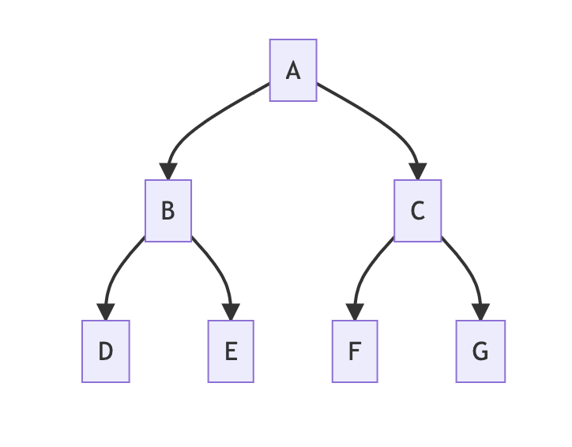
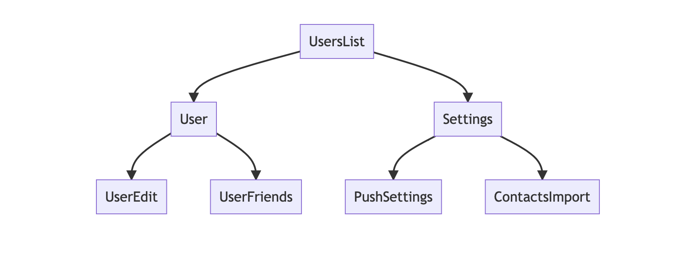
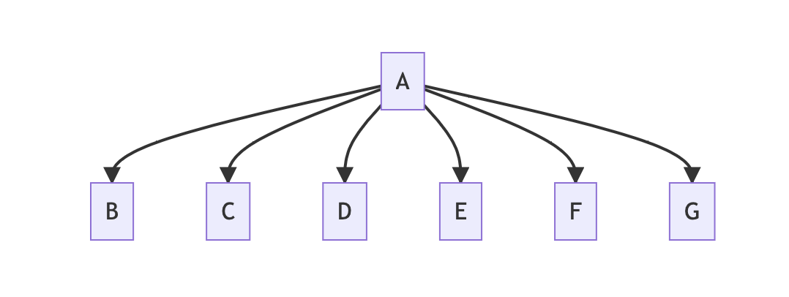
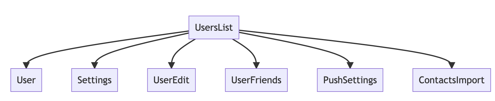

autoscale: true

# SwiftUI Navigation & URL Routing

* Brandon Williams
  * brandon@pointfree.co
  * @mbrandonw

^ Hello, my name is Brandon, and today I will be discussing SwiftUI navigation and URL routing.

^ Here's some of my contact information for you all in case you want to reach out with some questions.

---

# SwiftUI Navigation & URL Routing

* Brandon Williams
  * brandon@pointfree.co
  * @mbrandonw
* Stephen Celis
  * stephen@pointfree.co
  * @stephencelis

^ And before getting into everything I want to say that everything I am discussing today is joint work with my collaborator Stephen Celis. And if you were not already aware, Stephen and I run a website called Point-Free where we talk about things like what I'm about to talk about, and a whole lot more.

---

# What is navigation?

^ Now, the talk today is primarily about SwiftUI navigation. We are going to go really deep into the topic. And then at the end we will sprinkle in a bit of URL routing. We aren't going to spend a ton of time on that because we will see that if you approach navigation a particular way, then URL routing basically comes for free, which is awesome to see.

^ But, let's start with basics, because I think the word "navigation" can mean a lot of different things to different people.

---

# Drill down navigation


^ I think we can all agree that this is navigation. This is perhaps the most prototypical version of navigation and has been in iOS since the very beginning. We drill down from one screen to another, and  we can then pop back to the first screen.

^ The APIs for performing this kind of navigation even have the word "navigation" right in them, such as `NavigationView`, or `NavigationStack`, or `NavigationLink`, and even back in UIKit we have `UINavigationController`.

^ But, I also think we can expand our horizons a bit when it comes to navigation.

---

# Sheets


^ Afterall, if drill down animations constitute navigation, then shouldn't sheets be too?

^ They slide from bottom-to-top instead of right-to-left, but it still takes you from one screen to another screen.

^ Though one difference is that with sheets you can see a tiny bit of the previous screen behind the sheet...

---

# Full screen covers


^ ...but that's not the case for full screen covers.

^ These are like sheets, but they take over the entire screen. Now this is basically identical to drill-down navigation we saw a moment ago, except it is oriented vertically instead of horizontally.

^ so surely we should consider this navigation even though the APIs to make this happen have no mention whatsoever of the word "navigation". 

---

# Popovers


^ But if sheets and covers are navigation, then are popovers too?

^ Afterall, popovers on iPads naturally degrade to sheets on iPhones. If popovers are _not_ navigation, then it means somehow the notion of navigation is a platform specific thing. that is, popovers would be navigation on iPhones because they essentially behave like sheets, but then suddenly are not navigation on iPads. 

^ That would be really strange.

---


^ So, I personally think that all of these things are forms of navigation.

^ And I think there are even more out there. I would even classify tab views as navigation, and even alerts and action sheets as navigation.

^ and you could even define your own notions of navigation. it doesn't have to be confined only to the tools that Apple gives us in SwiftUI.

---

# What is navigation?

> A change of mode in the application.

^ So, for the purposes of this talk, the loose definition of "navigation" will be that it is a mode change in the application. Whether that is drilling down to a new screen, or a sheet flying up, or a popover taking control of the screen, or even an alert appearing.

^ But what does it in mean in more technical terms? How can we turn this nebulous idea into actual code?

---

# What is a “change of mode”?

> It’s when a piece of state goes from **not existing to existing**, or the opposite, **existing to not existing**.

^ Well, I will further refine a "change of mode" as meaning that some piece of state went from not existing to existing, 

^ So, when a piece of state switches from not existing to existing, that represents a navigation to a new mode of the application. 

^ And then when that state switches back to not existing, it represents us undoing that navigation and returning back to the previous mode.

^ And the cool thing is that these mode changes can build upon each other. So if you want to navigate two layers deep, it just means there are two pieces of state that come into existence, and the second piece of state is stored inside the first.

^ For example, you could have a drill down to a screen that then shows a sheet. There's one piece of state that represents the drill down, and then inside that state there is another piece of state that represents the sheet.

^ I'm using the nebuluous term "existing" here because there are a few ways in which existence of state can be represented. One of the most prototypical ways is to use optionals, so that `nil` represents no state, and when it switches to something that is non-`nil` that triggers the navigation.

^ but there are also other ways to represent this idea, such as booleans, arrays and enums, and we'll be getting more into that later.

---

# Navigation APIs

^ So, we now have a loose definition of navigation, and we know roughly what we want it to mean when we say we are navigating somewhere.

^ Let's see what this means in really concrete terms by looking at the navigation APIs that ship with SwiftUI. Let's start with some of the simpler ones.

---

# Sheets

[.code-highlight: all]
[.code-highlight: 1]
[.code-highlight: 2]
[.code-highlight: 3]
[.code-highlight: all]
```
func sheet<Item, Content>(
    item: Binding<Item?>,
    content: (Item) -> Content
) -> some View
```

^ Sheets can be shown with the following API. It's a view modifier, and you hand a binding of an optional value to it. 

^ It detects when the binding flips to a non-`nil` value, and with that honest value invokes the `content` closure to get a view for the sheet, which means the view can depend on the data, and then does the work of animating the view onto the screen from the bottom of the screen.

^ Further, once it detects that the binding flips back to `nil`, it automatically dismisses the sheet.

^ We are seeing in very concrete terms what it means to have navigation driven off some state coming into existence and then ceasing to exist.

---

# Sheets

[.code-highlight: all]
[.code-highlight: 3]
[.code-highlight: 7-9]
[.code-highlight: 11-13]
```
struct UsersView: View {
  @State var users: [User]
  @State var editUser: User?

  var body: some View {
    List {
      ForEach(self.users) { user in 
        Button("Edit") { self.editUser = user }
      }
    }
    .sheet(item: $editUser) { user in 
      EditUserView(user: user)
    }
  }
}
```

^ And this is what it looks like at the call site to use.

^ you hold onto some optional state that represents if the `EditUserView` is presented or not

^ Then somewhere in the view something causes the `editUser` state to go from `nil` to non-`nil`. In this case it's a button.

^ That causes the `.sheet` modifier to see the data is now present, and so the sheet's view builder is invoked with that data and the view comes up.

---

# Sheets

```
Button("Edit") {
  Task {
    let freshUser = try await self.apiClient.fetchUser(user.id)
    self.editUser = freshUser
  }
}
```

^ What's also cool about this is that you are free to execute some logic before the sheet appears. For example, suppose tapping the button executes a network request to first fetch the newest data for the user, and then once that completes you show the sheet. That would be incredibly simple to do with this API.

^ This kind of navigation is just very flexible. You can execute effects or perform validation before showing the sheet, and it all just works since the sheet's presentation and dismissal is all driven off of this one piece of state.

^ This kind of navigation is also very easy to unit test. You have to do the upfront work of moving your logic out of the view, like say to an observable object, but once you do that you can construct that object in the test, invoke the method that represents the user tapping on the edit button, do some awaiting while the view model does its thing, and then assert that some `nil` piece of state flipped to be non-`nil`.

^ If you trust SwiftUI to interpret that non-`nil` data correctly and show your sheet, then you have just written a unit test for navigation. No need to mess around with slow, flakey UI tests.

---

```
func fullScreenCover<Item, Content>(
    item: Binding<Item?>,
    content: (Item) -> Content
) -> some View
```

^ and it turns out that a lot of navigation APIs in SwiftUI follow this form.

^ here's what it looks like to show a full screen cover. again it takes a binding of an optional state so that when it detects the state becomes non-nil the view is presented, and then once the state goes `nil` it is dismissed.

---

```
func popover<Item, Content>(
    item: Binding<Item?>,
    content: (Item) -> Content
) -> some View
```

^ popovers also follow this model.

^ again it takes a binding of an optional and simply detects when the binding becomes non-nil and nil so that it can present and dismiss.

^ if i quickly cycle between these three APIs we will see they are basically identically except for their name

---

```
func sheet<Item, Content>(
    item: Binding<Item?>,
    content: (Item) -> Content
) -> some View
```

---

```
func bottomMenu<Item, Content>(
    item: Binding<Item?>,
    content: (Item) -> Content
) -> some View
```

^ further, your _own_ UI components can and probably should follow this pattern.

^ so you wanted your own little bottom menu UI that pops up at the bottom of the screen. then a great way to model the showing and hiding of that content is through a binding of an optional value.

---

```
func sheet<Item, Content>(
    isPresented: Binding<Item?>,
    content: @escaping () -> Content
) -> some View

func fullScreenCover<Item, Content>(
    isPresented: Binding<Item?>,
    content: @escaping (Item) -> Content
) -> some View

func popover<Item, Content>(
    isPresented: Binding<Item?>,
    content: @escaping (Item) -> Content
) -> some View
```

^ So, we can see that these 3 seemingly different forms of navigation are all really unified under a single interface

---

# Deep-linking
## as easy as 1-2-3

^ but the benefits to thinking of navigation in this way far exceed just simple aesthetics of API design.

^ for example, deep linking

^ just so that we are all on the same page, when I say "deep linking" i mean the ability to instantly open the application in a particular state. deep linking is most often associated with _URL_ deep linking where you map certain known URLs to parts of your application, but the idea is far more general than that.

^ deep linking can also be important for handling push notifications, where if the user opens a notification you may want to put your app in a very specific state, such as being drilled down to a screen with a popover open.

^ it can also be useful for state restoration where you record the state of the application when it is closed so that next time you open it up you can restore the UI to how it was last time.

^ when navigation is driven off of state, then deep linking basically comes for free with no additional work.

---

# Step 1
### Define the model

[.code-highlight: all]
[.code-highlight: 1-3]
[.code-highlight: 2]
[.code-highlight: 5-7]
[.code-highlight: 6]
```
class Model: ObservableObject {
  @Published var sheet: SheetModel?
}

class SheetModel: ObservableObject {
  @Published var popoverValue: Int?
}
```

^ let's quickly go through the steps. the first two steps are just things you have to do no matter what, whether you support deep linking or not.

^ you will define some observable objects that hold the state, logic and behavior of your features.

^ here i've modeled a kind of "parent" feature that holds onto an optional "sheet" feature. the optionality of the sheet model is what determines whether or not we are currently navigated to the sheet feature.

^ and in the sheet domain we hold a value that determines if a popover is shown.

^ All of this code is of course very basic and not very real world oriented, but these are the basic shapes of problems you would encounter in the real world.

---

# Step 2
### Define the views

[.code-highlight: all]
[.code-highlight: 2]
[.code-highlight: 5]
[.code-highlight: 6-8]
```
struct ContentView: View {
  @ObservedObject var model: Model

  var body: some View {
    Button("Show sheet") { self.model.sheet = SheetModel() }
      .sheet(item: self.$model.sheet) { sheetModel in
        SheetView(model: sheetModel)
      }
  }
}
```

^ With the domain modeled and the logic implemented, we define the views for the parent and sheet features using the models we defined before.

^ for example, in the parent feature we can hold onto an observed object for the model

^ and then when a button is pressed we can instantiate the sheet model to indicate that we want to navigate to the sheet feature

^ and we can handle that navigation even by using the `.sheet` view modifier to listen to when the sheet mode becomes non-nil, and when it does display a `SheetView`

^ and that `SheetView` is implemented in basically the same way...

---

# Step 2
### Define the views

[.code-highlight: all]
[.code-highlight: 2]
[.code-highlight: 5-7]
[.code-highlight: 8-10]
```
struct SheetView: View {
  @ObservedObject var model: SheetModel

  var body: some View {
    Button("Show popover") {
      self.model.popoverValue = .random(in: 1...1_000)
    }
    .popover(item: self.$model.popoverValue) { value in
      PopoverView(count: value)
    }
  }
}
```

^ where we hold onto the sheet model

^ have a button to the optional state into something non-`nil`, in this case we are just choosing a random number.

^ and then we listen for that optional to become non-`nil` in order to show a popover, and we do that by creating this `PopoverView` and handing it its initial value.

---

# Step 2
### Define the views

[.code-highlight: all]
[.code-highlight: 2]
[.code-highlight: 5,6,7]
```
struct PopoverView: View {
  @State var count: Int
  var body: some View {
    HStack {
      Button("-") { self.count -= 1 }
      Text("\(self.count)")
      Button("+") { self.count += 1 }
    }
  }
}
```

^ and the leaf node of the application we have the popover view.

^ It holds onto a bit of local, internal state which is seeded from the parent view, and it will expose buttons for mutating that state in some way, such as incrementing and decrementing.


---

# Step 3
### Construct state to deep link

[.code-highlight: all]
[.code-highlight: 3]
[.code-highlight: 4]
```
ContentView(
  model: Model(
    sheet: SheetModel(
      popoverValue: 42
    )
  )
)
```

^ That was a big step 2, but there's just one final step to deep link into a very particular state of the application, and it's the easiest. It's the thing we basically get for free by properly modeling navigation as state:

^ We can just construct a piece of state that represents where we want to navigate and it hand it off to SwiftUI to let it do its thing.

^ Thanks to the fact that the sheet and popover and driven off of this state it all just magically works. swiftui detects that the `sheetModel` is non-nil and so slides up a sheet, and then it detects that the popover value is non-`nil` and then shows a popover.

---

# Deep linking
## Demo

^ let's demo this real quick.

^ i have a project with all of this code already written, as well as a few small additional details that i'm omitting in order to not clutter what we are talking about here

^ go to SheetThenPopoverView and demo

---

# Sheets, 
# covers,
# & popovers

^ and so we have now seen that sheets, full screen covers and popovers all have very similar APIs.

^ they all require you to hand it a binding of some optional data so that the navigation can be driven off of state

---

# Navigation links

^ and that now brings us to navigation links, which is the thing that probably everybody really thinks of when they think of navigation

^ considering that all other forms of navigation encountered so far were easily expressible with bindings of optional state, we might hope that navigation links worked the same

---

## Theoretical NavigationLink

[.code-highlight: all]
[.code-highlight: 2]
[.code-highlight: 3]
```
NavigationLink(
  item: Binding<Item?>,
  destination: (Item) -> Destination, 
  label: () -> Label
)
```

^ Let's theorize what a navigation link could look like based on what we just learned.

^ Perhaps you could hand it a binding of an optional piece of state, and then when it detects that the state becomes non-`nil` it will cause a drill down animation to happen

^ further, the destination view you drill down to could be dependent on that new, non-`nil` data, allowing it to be dynamic.

^ this sounds great in theory, but it has a problem. this can't possibly work because unlike sheets/covers/popovers, navigation links are meant to be tapped to start the drill down. They are basically buttons.

^ so the action that causes the state to become non-`nil` needs to be somehow baked into the navigation link's api

---

## Theoretical NavigationLink

[.code-highlight: 3]
```
NavigationLink(
  item: Binding<Item?>,
  action: () -> Void,
  destination: (Item) -> Destination, 
  label: () -> Label
)
```

^ which means it just needs to look something like this

^ there is an additional parameter for an action closure that is invoked when the navigation link is tapped. in that action closure you can do whatever necessary to hydrate the state to be something non-`nil`, and then the drill down navigation will occur

---

## Theoretical NavigationLink

[.code-highlight: all]
[.code-highlight: 6]
[.code-highlight: 2]
[.code-highlight: 1,3,4]
```
NavigationLink(item: self.$model.editUser) {
  self.model.editUser = user
} destination: { user in
  EditUserView(user: user)
} label: {
  Text("Edit user")
}
```

^ in practice, that might look something like this.

^ we have a link with a label that says "Edit user"

^ when tapped the action closure is executed which causes the `editUser` state to be hydrated. it may be able to do that synchronously and immediately, or it may need to perform some async work and then update state.

^ but either way, at some later point the `editUser` state will become non-`nil`, and that will allow us to construct the destination with some initial state and start the drill down process.

---

# Navigation odd ducks 🦆

```
NavigationLink(
  destination: () -> Destination, 
  label: () -> Label)

NavigationLink(
  isActive: Binding<Bool>,
  destination: () -> Destination, 
  label: () -> Label)

NavigationLink(
  tag: Hashable, 
  selection: Binding<Hashable?>, 
  destination: () -> Destination, 
  label: () -> Label)
```

^ Well, unfortunately, that API is just a pipe dream and not reality at all. instead we have these 3 APIs, and in my opinion is one of the reasons why navigation links seemed so difficult to use since SwiftUI's inception.

^ i think evidence of this is that, in my experience, people don't seem to have many problems understanding how to properly wield the sheets/covers/popover APIs. They understand them pretty intuitively. But the navigation APIs have always seemed a bit more mystifying for some reason.

^ But alas, these are the APIs we had for a long time, though they are now deprecated. either way, let's take a quick look at them one-by-one.

---

# Navigation odd ducks 🦆

```
NavigationLink(
  destination: () -> Destination, 
  label: () -> Label
)
```

^ first there's this weird one. there's no equivalent to this kind of API over in sheets/covers/popovers.

^ this initailizer only takes builder closures for describing the destination and label for the link. there's no binding whatsoever.

^ This kind of link works in a "fire-and-forget" fashion. If the user taps the link, a drill down animation happens to the destination, but there is no change whatsoever in state to represent this fact. The navigation link manages all of that state internally and we never get to see it.

^ this kind of link can be really handy in a pinch because it's so simple to use, but it also means you have no way whatsoever to programmatically deep link into the destination screen. Truly the only way to invoke the drill down is for the user to literally tap on the link. So, if you ever need to navigate to the destination via a deep link URL or a push notification or some other mechanism, this type of link is not for you.

^ And that's just the trade off for using this kind of navigation.

---

# Navigation odd ducks 🦆

```
NavigationLink(
  isActive: Binding<Bool>,
  destination: () -> Destination, 
  label: () -> Label
)
```

^ next there's this API, which does have a binding, but it's a boolean instead of an optional. 

^ This is a state driven API, and the idea of it is that the link will listen for when the boolean becomes `true`, and when it detects that it will perform the drill down animation to the destination view. And if the user taps the link, SwiftUI will write `true` to the binding.

^ And booleans do fit into our mental model of navigation being the act of state ceasing to exist and then existing. We can think of `false` as no data, and `true` as having data, it's just that there is nothing interesting about the data. You could even think of a boolean as an optional void value, after all both types have exactly 2 values, so it does fit into the model we described earlier.

^ It's also worth mentioning that sheets, covers and popovers also expose a boolean-binding interface, but we didn't discuss it because it's just a special case of the more general optional-binding.

^ So this allows us to drive navigation off of boolean state. And in fact, we can even implement that theoretical optional-driven navigation link from a moment ago in terms of this boolean binding one, so all is not lost. it just takes some work to do, and so most people are not going to know they need to do that.

---

# Navigation odd ducks 🦆

[.code-highlight: all]
[.code-highlight: 2]
[.code-highlight: 3]
[.code-highlight: 4]
[.code-highlight: all]
```
NavigationLink(
  tag: Hashable, 
  selection: Binding<Hashable?>, 
  destination: () -> Destination, 
  label: () -> Label
)
```

^ and finally we have this API. this is the API that kinda allows you to drive navigation off of optional state, but it's quite different from the other optional-state APIs we have seen.

^ it takes something called a tag, which is some hashable data. it's intended to be some kind of identifier for the destination you want to navigate to. for example, if you were capable of navigating to a user screen you might use the user's id for the tag.

^ then it takes a binding of some optional hashable data. When you tap the link it will write the tag to the binding, and then that will trigger the drill down to the destination view.

^ But tapping the link isn't the only way to trigger the navivgation. The link will listen for anytime the seletion goes from `nil` to non-`nil`, even if a tap didn't happen, and that will also trigger the drill down animation.

---

[.code-highlight: all]
[.code-highlight: 3]
[.code-highlight: 8-9]
[.code-highlight: 8-10]
```
struct ContentView: View {
  @State var users: [User]
  @State var editingUserID: User.ID?

  var body: some View {
    List {
      ForEach(self.users) { user in 
        NavigationLink(
          tag: user.id,
          selection: self.$editingUserID
        ) {
          EditUserView(userID: user.id)
        } label: {
          Text("Edit user")
        }
      }
    }
  }
}
```

^ To me it seems that maybe this API was designed with this use case in mind. You have a list of navigation links and you want a single binding to drive all of those links.

^ here we hold onto a bit of optional state that has the id of the user you want to be able to navigate to

^ and then inside the `List` and `ForEach`  you can construct a navigation link whose tag is the user id that corresponds to the row you are rendering, and then hand it the binding from the root that determines which id is currently selected.

^ And so if you build you application using these state-driven navigation APIs, you will instantly unlock deep-linking capabilities, even if your navigation includes a mixture of drill downs, sheets, covers and popovers.

---

# Demo

^ to see this, let's demo it.

^ i have an application prebuilt that is basically identical to what I demo'd a moment ago for a sheet and popover, but now I have put a drill down before those two other types of navigation.

^ so now you can drill down, then open a sheet, and then open a popover.

^ however, if we wanted to open the application so that it is immediately in the state of being drilled down, sheet up and popover open, it's as simple as constructing a piece of state, handing it to SwiftUI, and letting SwiftUI do the rest.

---

# Navigation problems

^ So, theoretically deep linking is as easy as constructing a piece of state, handing it off to SwiftUI and letting SwiftUI do its thing.

^ but in practice it didn't always work out exactly like that. there were a few problems.

^ first there are some bugs in SwiftUI that make it impossible to drill down more than 2 levels deep. I have a very simple demo to show  this (do that: NestedDrillDown)

^ so that was one problem

---

# Destination coupling

^ And there was another major probllem

^ While I personally thing that state-driven navigation is one of _the_ most important concepts to internalize, there's another concept that is nearly as important, and I think some people would say it's even more important.

^ And that's decoupling of navigation destinations.

---

[.code-highlight: all]
[.code-highlight: 2,7,11,15]
```
NavigationLink(
  destination: () -> Destination, 
  label: () -> Label)

func sheet<Content>(
    item: Binding<Item?>,
    content: @escaping (Item) -> Content) -> some View

func fullScreenCover<Content>(
    item: Binding<Item?>,
    content: @escaping (Item) -> Content) -> some View

func popover<Content>(
    item: Binding<Item?>,
    content: @escaping (Item) -> Content) -> some View
```

^ there is something about these API signatures that isn't quite ideal.

^ in all 4, the very act of invoking the API inextricably couples the source view that wants to perform the navigation to the destination you are navigating to, which is given by the `destination` and `content` closures

^ This means if you have a feature that can navigate to, say, a settings screen, your feature that wants to do the navigating must build the settings feature in order to get access to those symbols and actually make use of these APIs.

---



^ Here is a visualizastion of what navigation coupling looks like from a dependency perspective.

^ Each box represents a feature, and each curve between boxes represents that you can navigate from one feature to another.

^ If a feature depends on the code of the features it can navigate to, it means we must build all destination features before we can build the parent feature. And not just the destinatinos, but also the destinations of the destinations, and on and on.

^ This means that leaf nodes will build super quickly because they basically have no dependencies, but as you go up the tree towards the root, things will get slower and slower to compile.

---



^ For example, suppose in user list feature you can navigate either to a particular user or the settings screen. And then in each of those screens you can navigate to a few places.

^ In order to implement new functionality or fix bugs in the `UsersList` feature, we must build all of the other features down below. And the functionality we are trying to implement or the bug we are trying to fix may not have anything to do with any of those features.

^ and that may not seem like a big deal, but over time it can become a big deal. Some of the features lower down in the tree may start to get bloated and take a long time to compile on their own, and that will directly increase the compile times of the `UsersList`.

^ For example, the `Settings` screen could start to depend on a heavy weight 3rd party library, like firebase, in order to sync settings to an external server.

^ Or the `UserEdit` feature could pick up a dependency on an analytics SDK because that team wants to start instrumenting certain user behavior. Those decisions seemingly only affect the team working on that specific feature, but secretly affects anyone working on a feature higher up the tree too.

^ now you may have never actually even experienced the problem i'm trying to explain here. it tends to affect large teams where it becomes difficult if not impossible to make sure that features don't bloat and take a long time to compile.

^ But there are other benefits to decoupling, such as improving the stability of certain tools. For example, Xcode previews are incredibly powerful, but they can also be brittle. One of the best ways to improve their stability is to build the minimal amount of code necessary for the preview. That can be done by decoupling views and putting each feature in their own isolated module.

---



^ If you were to decouple your features, then the code dependency tree would look more like this. Essentially, the broader the tree and the less deep the tree, the more isolated it is.

---



^ This would allow us to implement new functionality and fix bugs in each of these child features without building anything unnecessary.

^ Now, this all sounds great in theory and in this fancy diagram, but I do want to point out the flip side of this.

^ Decoupling features does come with additional complexity and is not a panacea. It makes it harder to test certain things in isolation.

^ For example, now the only way to play around with the navigation that goes from the settings screen to the push settings screen is to run it in the full `UsersList` feature. This means you would run the app, navigate to the users list, tap the settings button, and then tap the push settings button.

^ Previously you could have run the settings feature in isolation and just wrapped everything in a `NavigationView`. Sure settings and push settings were coupled together, but then that means you can test their coupling in isolation. 

^ With _fully_ decoupled navigation you lose that ability. So, it can still be important to think more about where you truly need to decouple navigation and where it is OK to leave things coupled.

---

# Navigation stacks

^ So, the two problems we just mentioned, the bugs that plagued SwiftUI navigation links and the coupling of sources and destinations, seems to have led Apple to completely reconsider the navigation API.

^ iOS 16 introduced a brand new API for drill-down navigations that can help decouple navigation destinations. It's called navigation stack, and Apple is so happy with this API that they deprecated all of the navigation link APIs we discussed a moment ago.

^ It's worth mentioning that even with navigation stacks the coupling problem we discussed all the other forms of navigation. For example, suppose the settings feature from a moment ago was not a drill down from the users list feature, but instead poppped up in a sheet. Then you have no choice but to use the `.sheet` view modifier to do that, and once you have done that you have coupled the users list feature to the settings feature.

^ So, it's still on you if you want to decouple your features for all of the other kinds of navigation we have discussed in this talk. But at least for drill-down animations, Apple has provided a tool

---

* `NavigationStack`
* `NavigationLink`
* `.navigationDestination`

^ In order to accomplish this decoupling the API for navigation had to be spread across 3 APIs: two are views and one is a view modifier.

^  And it makes sense that it would need to be spread across a few APIs. If it was all in one single API then how could we decouple? The very act of constructing the thing requires access to the source and the destination.

---

## Decoupling navigation: Data

[.code-highlight: 1-4]
[.code-highlight: 6-8]
```
NavigationLink(
  value: Hashable?,
  label: () -> Label
)

NavigationLink(value: user.id) {
  Text("Edit user")
}
```

^ In order to decouple the source and destination of a drill-down navigation, we need the ability to specify a piece of data that _describes_ the navigation without specifying the actual destination view of the navigation.

^ This is done with a new initializer on `NavigationLink` that takes a piece of data that can be any hashable value, as well as the label for the visual display on the link.

^ So, with this initializer we do not mention at all the view we want to navigate to. We only describe a piece of data that represents where we want to go to, and it will need to be interpreted later.

^ When you tap the link, the data is sent through every view layer all the way up to the root, and that data can be intercepted at any point to actually interpret the data and then decide which destination we should navigate to. This data flows to _all_ views above the link, even to siblings of parent views.

^ This is one part to the key for decoupling the source of navigation from the destination: the separation of data from interpretation of that data. We can see plain as day here that the view holding this navigation link to edit a user does not need to compile the "edit user" feature. There is no mention of any of its symbols, therefore we don't need to compile it.

---

## Decoupling navigation: Interpretation

[.code-highlight: 1-4]
[.code-highlight: 2]
[.code-highlight: 3]
[.code-highlight: 6-8]
```
func navigationDestination<Data: Hashable>(
  for: Data.Type, 
  destination: (Data) -> Destination
) -> some View

.navigationDestination(for: User.ID.self) { userID in 
  EditUserView(id: userID)
}
```

^ Then, somewhere up the view heirarchy we can intercept the data that is sent from a navigation link and interpret it using this view modifier. This can happen in pretty much _any_ parent view.

^ We first specify the _type_ of data we want to intercept, because technically we are allowed to make each navigation link in our application send up a different kind of data.

^ Then, once SwiftUI sees a piece of navigation data going up the view heirarchy that matches the type, it intercepts that data, passes it to the trailing closure, and whatever view we return from there will be the view that is drilled down to. We can hand that data to the next view and let it do its thing.

^ This is the second part to the key for decoupling source and destinations in navigation. Here we are able to intercept this simple user id so that we can trigger a drill-down to the edit user view.

---


^ So, we can now see that this new form of navigation does accomplish this type of dependency tree. All of the destination features, B through G, can be built in full isolation without building any of the other features.

^ Each of B-G just needs to be able to construct a navigation link with a piece of data that describes where they want to go, but this can be something super lightweight, like the id of a model, such as a user or a photo or whatever.

^ And the only feature that needs to actually build feature B-G is whoever uses the `.navigationDestination` modifier to interpret the data and build a destination.

---

## Fire-and-forget

```
NavigationLink("Edit user", value: user.id)

.navigationDestination(for: User.ID.self) { userID in 
  EditUserView(id: userID)
}
```

^ So, we have now shown how drill-down navigation can be fully decoupled, but technically what we have described still falls in the "fire-and-forget" category of navigation rather than the "state-drive".

^ It may seem state driven because after all we are using data to trigger the navigation, but really that data is only used for interpretation to figure out which destination to go to.

^ The only real way to trigger navigation is for the user to literally tap on a navigation link. That means it is not quote-unquote "state-driven" since there is no way to simply construct a piece of state, hand it over to SwiftUI, and have SwiftUI do its thing to present the final view.

^ And we've seen a few times now, that can be incredibly powerful.

---

## State-driven 
## NavigationStack

^ This is where the new `NavigationStack` comes into play.

^ It supplants `NavigationView` as the entry point into drill down navigation on iOS, and `NavigationView` is now "soft" deprecated. Soft deprecated means that it is actually deprecated. If you look in the docs it will have the big yellow warning about that. But warnings are not produced in Xcode yet, so you are not told to convert everything immediately. That will come later on.

---

[.code-highlight: all]
[.code-highlight: 1-9]
```
NavigationStack(
  path: Binding<Data>,
  root: () -> Root
) 
where 
  Data: MutableCollection 
      & RandomAccessCollection 
      & RangeReplaceableCollection, 
  Data.Element: Hashable

NavigationStack(
  path: Binding<NavigationPath>,
  root: () -> Root
)
```

^ And these are the two main ways you can create a state-driven navigation stack.

^ First there's the seemingly complex one that takes a binding of a collection of hashable data, and there's all types of constraints that make it look scary.

^ But really at the end of the day, I think almost everyone is just going to use an array with this API.

---

[.code-highlight: 1-5]
```
NavigationStack(
  path: Binding<[Element]>,
  root: () -> Root
) 
where Element: Hashable

NavigationStack(
  path: Binding<NavigationPath>,
  root: () -> Root
)
```

^ So let's wipe away all of that noise to get something much nicer. The initializer takes a binding to an array of hashable elements.

^ So, the idea behind this binding is when a user taps a navigation link, the data associated to that link will be appended to this array. And further, when the user taps a back button or does a swipe gesture, the value will be popped off the array.

^ In parallel with that, the `.navigiationDestination` view modifier is doing its normal job of looking for data of a particular type to intercept and interpret.

^ This binding allows us to programmatically drive navigation. If a push notification comes in, or we detect a deep link URL was opened, we just have to pick apart that data to figure out where we want to navigate, and then add or remove elements from this array. SwiftUI will see that the array changed, invoke all of the appropriate `.navigationDestination` view modifiers to get the destination views, and then perform the necessary push or popping animations.

^ It is worth noting that when using this form of binding, then the data associated with navigation links must all be of the same. It all needs to be homogenous.

---

[.code-highlight: 7-99]
[.code-highlight: all]
```
NavigationStack(
  path: Binding<[Element]>,
  root: () -> Root
) 
where Element: Hashable

NavigationStack(
  path: Binding<NavigationPath>,
  root: () -> Root
)
```

^ The second type of initializer takes a binding of something called a `NavigationPath`. 

^ This is a wild type. It is something that acts like a collection, in that it has methods for appending to the end and removing from the end, and you can count the number of elements, but then that's it.

^ You can't iterate over the elements, you can't access a particular element, you cant remove or add from the _beginning_ or _middle_ of the collection. The internals of the quote-unquote "collection" are completely opaque to us. The elements are even type erased under the hood because you are allowed to append _any_ hashable data to this thing.

^ Other than it's weird type erasedness, it mostly works as the other initializer. If a navigation link is tapped, that data is appended to the collection. The `.navigationDestination` still listens for data flowing up the view heirarchy in order to intercept certain pieces of data and interpret it. And finally, if the `NavigationStack` observes a change in the path it will do pushes and pops accordingly. 

^ But the key difference is that any kind of data can be attached to a navigation link since navigation path is type erased. You aren't constrained to use the same static type for all links.

^ And it's worth noting that in my opinion these types of initializers still fall under the purview of that concept I discussed earlier about state coming into existence and then going out of existence. In this case, a piece of state goes from not existing to existing the moment it is added to the array, and then it ceases to exist once it is popped from the array.

---

[.code-highlight: 1-4]
[.code-highlight: 6]
[.code-highlight: 8-99]
```
var path = NavigationPath()
path.append(42)
path.append("Hello")
path.append(false)

var encodedData = try JSONEncoder().encode(path.codable!)

var decodedPath = NavigationPath(
  try JSONDecoder().decode(
    NavigationPath.CodableRepresentation.self,
    encodedData
  )
)
```

^ I'm not going to go super in depth into `NavigationPath`, but I do want to give you a preview of just how wild this type is.

^ So you can append an integer, then a string, and then a boolean, and it will happily take it all. 

^ Also wild, you can encode this collection of nebulous, type erased elements into some data that can be saved to disk or sent over the network. That seems wild to me because all the elements are type erased, so what could that those raw serialized bytes even look like?

^ But but then even more bizarre, you can somehow decode those raw bytes back into a `NavigationPath`. How could it possibly produce a Swift value from raw bytes that were encoded from type erased data?

^ And then you can somehow take that newly formed navigation path and plug it into the navigation stack view's binding causing the UI to be updated to represent the data you hand it. that means it will do any pushing and popping necessary.

^ And that is really bizarre to think about because in order for that restoration process to happen the `.navigationDestination` view modifiers must be invoked in order to get a destination, which means somehow real, strongly typed data is produced from this nebulous, type erased data that was just resurrected from raw bytes. 

^ It's honestly pretty cool, and seems to solve state restoration in a simple 1-2-3 step proces, but sadly in its current for is not actually usable in production. If you restore a navigation stack with decoded navigation path data, you will eventually get a crash deep in the SwiftUI framework, and sadly that was not fixed before the final iOS 16 release.

---

# Pros and cons 
# of the two initializers

^ So, Apple has provided two flavors of state-driven `NavigationStack`, so which should we use.

^ There are pros and cons to each, so let's enumerate a few real quick.

---
[.build-lists: true]

### Binding<[Element]>
### Pros

* Strongly typed elements
* Full access to collection API
* Instant testability
* Codable state restoration

^ The pros of using a binding of a strongly typed collection is that, well... you get strongly typed elements! This means there is no ambiguity whatsoever is what data is being presented, you always know.

^ You also get full access to the collection API. For example, suppose, for whatever reason, a feature of your application is that you could literally shuffle the current navigation stack. That is quite easy here because you have access to the actual collection of elements. Or say you want to aggregate the states in the stack in some way, like add up all the counter values on each screen. again that is quite easy.

^ You also get instant testability. You can write a test for your observable object model thing that says the user tapped this button, and async effect executed and fed data back into the model, and that caused a new value to be appended to the navigation stack. And because SwiftUI is state-driven, if that test passes then you can be reasonably sure that that would actually happen on the device. No need to run a UI test.

^ And finally, it's very easy to make this array of elements codable, which gives you instant state restoration with no crashes. In fact, now that enums can automatically synythesize codable this is easier than ever.

---
[.build-lists: true]

### Binding<[Element]>
### Cons

* Some light coupling with `NavigationLink`
* Single point of handling destinations

^ So, that all sounds good, but there are also some downsides.

<!-- todo: talk about navigation link specifically -->

^ First, having such a strongly typed collection of elements does lead to a little bit of coupling. But it's not nearly as bad as before. It's just a little bit.

^ For example, the only way for a strongly typed collection to work is if you handle _all_ destinations from a single `.navigationDestination` view modifier. You're not allowed to handle some destinations over here and others over there.

^ I personally think this is an artificial restriction. I think SwiftUI could have a version of `.navigationDestination` that allows you to say "i don't want to handle this data, keep sending it up the view heirarchy to set someone else try".

---
[.build-lists: true]

### Binding<NavigationPath>
### Pros

* Extremely easy to get started with
* Maximum decoupling

^ Navigation path has some really great pros.

^ First of all, it is extremely easy to get started with. You can just sprinkle in some navigation links with data throughout your views, add a few `.navigationDestination` view modifiers to handle the data, and off you go. It's honestly pretty incredible.

^ It also maximizes the amount of decoupling. Because you can navigate to _any_ kind of hashable data you aren't forced to handle all destinations in a single `.navigationDestination` view modifier. you can handle user id navigation data over here, and then photo id navigation data over there in some other view, and on and on. This allows you to decouple things in a very extreme sense.


---
[.build-lists: true]

### Binding<NavigationPath>
### Cons

* Not testable
* Not inspectable
* Codability has runtime crashes

^ So it's an amazing tool, but it also has its cons.

^ The moment you use navigation path you pretty much eject yourself from any hope of testing logic around navigation. Because NavigationPath is so opaque and because they offer no APIs for accessing the elements inside, even if they were exposed erased `any Hashable` values, means you can hit a method on your model observable object and then assert eventually something is appended to the path.

^ And kind of a corollary to not being testable, it's not inspectable which means you can't do cool things with your navigation stack like aggregate values.

^ And also, as of iOS 16.0, its codable interface crashes, so that's just not really usable right now.

---

# Which initializer to use?

^ So which one to use?

^ Well, unfortunately I think that's a very personal decision that I do not want to force on you.

^ When I look at that previous list of pros and cons, I really resonate with the features that give me strong types, inspectability and testability, and the short comings at least have somewhat decent workarounds. So I lean more towards the explicit collection binding style.

^ But it cannot be overstated just how powerful `NavigationPath` is at giving you state-driven navigation without going all in to everything being 100% static and well typed. In my mind it lies somewhere between the fire-and-forget navigation and the fully typed navigation. It is state driven, so not fire-and-forget, but at the same time it has forgotten about some things, like the types of the data elements in the collection.

^ But no matter which you use, with everything set up you will have instant access to easy deep linking into your application by just constructing a piece of state and handing it to SwiftUI, and even cooler, it also plays nicely with all the other forms of navigation we have discussed previously.

---

# Demo

^ Let's give a quick demo of this.

---

# URL routing

^ Ok, in the negative amount of time I have left I will quickly talk about URL routing.

^ Since we now know how to deep link into our applications by simply constructing a piece of data and handing it to SwiftUI, URL routing really just boils down to: how do we transform a nebulous URL request into that data that we can hand to SwiftUI

---

# URL routing

[.code-highlight: all]
[.code-highlight: 1-3]
[.code-highlight: 5]
[.code-highlight: 6]
[.code-highlight: 8]
```
/screenA -> ScreenA
/screenB -> ScreenB
/screenC -> ScreenC

/screenC/sheet    -> ScreenC w/ sheet open
/screenC/sheet/42 -> ScreenC w/ sheet and popover open

/screenA/screenB/screenC/sheet/42 -> stack of screens
```

^ For example, here are some URLs we might want to recognize for our application.

^ The first few are quite simple. If you go to our domain _slash_ screen A, B or C, then we expect to be drilled down to that respective feature.

^ And if on the screenC path component you further append a sheet path component, then screen C should start with the sheet open.

^ And if further a numeric path component is added we would like the popover to be opened with that value pre-populated

^ And finally, you may want to have a whole bunch of these URL fragments stacked on top of each other so that you open the application drilled into A and then B and then C with the sheet up and the popover open

---

## github.com/pointfreeco/
## swift-url-routing

^ There are lots of libraries out there whose entire purpose is to interpret a nebulous URL request so that you can pick it apart, match on it, and then do something when it matches.

^ They all have their pros and cons, and it just so happens that Stephen and I also have one. I am not at all recommending you use this. In fact, it probably isn't appropriate for if you are just starting to dip your toes into URL routing because it uses some pretty heavy machinery to do its job.

^ You should definitely use whatever routing library you prefer, or maybe you make your own, or maybe you just split your URLs path on the slashes and pick apart the URL yourself.

^ But, if someday in the future you need a little more power, then you may be interested in this library. Especially if you have intricate URLs you need to process, or if you also run a server-side application, like Vapor, because then you can have a single unified router for both your iOS app and server.

^ But, I will quickly show the code that allows to transform the URLs we want to support in our application. 

---

[.code-highlight: all]
[.code-highlight: 10-15]
```
enum Destination {
  // /screenA
  case screenA
  // /screenB
  case screenB
  // /screenC/:sheet
  case screenC(destination: ScreenCDestination? = nil)
}

// /sheet/:int?
enum ScreenCDestination {
  case sheet(popoverValue: Int? = nil)
}
```

^ The is the type that we want to transform a nebulous URL into, when possible. I've added little sample URLs to each case so that we can remember what it is we are trying to parse.

^ With URL routers its always easiest to start at the leaf nodes of your routes and work your way backwards to the root.

^ So we could first start parsing a little URL fragment into the `ScreenCDestination` enum

---

[.code-highlight: all]
[.code-highlight: 3, 6-11]
[.code-highlight: 3, 6,11]
[.code-highlight: 3, 7,10]
[.code-highlight: 3, 8]
[.code-highlight: 3, 9]
```
import URLRouting

// /sheet/:int?
struct ScreenCRouter: Parser {
  var body: some Parser<URLRequestData, ScreenCDestination> {
    Parse(ScreenCDestination.sheet(popoverValue:)) {
      Path {
        "sheet"
        Optionally { Int.parser() }
      }
    }
  }
}
```

^ And this is what it takes. Technically this is using a version of our library that isn't released yet. We have a Swift 5.7 branch that makes use of some of the powerful new features, and we will be releasing it soon.

^ Now it's a lot, but I want you to focus only on these few lines here. This is the actual description of how our parser will process an incoming URL request

^ It wants to parse into a particular case of the `ScreenCDestination`, and so it specifies that directly. In order t construct that case we need to produce a `popoverValue` which is an optional integer.

^ Then inside there we start describing all the various parts of the URL we want to parse and recognize. In this case we only want to parse path components, but if we needed to handle query fields there would be more to do here.

^ The first path component we want to parse is "sheet". If that fails, then whole parser fails and we short circuit the rest of the work.

^ Next, we want to try to parse an integer from the path component, but it isn't required. It's totally fine to recognize the URL of just "/sheet" with no further integer, so we express this by saying that the integer is optional

---

[.code-highlight: all]
[.code-highlight: 5-20]
[.code-highlight: 5,20]
[.code-highlight: 6-9]
[.code-highlight: 10-13]
[.code-highlight: 14-18]
```
import URLRouting

struct DestinationRouter: Parser {
  var body: some Parser<URLRequestData, Destination> {
    OneOf {
      // screenA
      Parse(Destination.screenA) {
        Path { "screenA" }
      }
      // screenB
      Parse(Destination.screenB) {
        Path { "screenB" }
      }
      // screenC/:sheet
      Parse(Destination.screenC(destination:)) {
        Path { "screenC" }
        Optionally { ScreenCRouter() }
      }
    }
  }
}
```


^ With that defined, we move up one layer to a router that can parse into the `Destination` type. 

^ Again, just focus on the middle part. We are saying that we are going to try to parse one of a few different' kinds of URLs

^ First, we try parsing the "screenA" path component, and if that succeeds we stop and bundle that up into the `screenA` case of the destination enum. And similarly for screenB.

^ For screen C we first try parsing the "screenC" path component, and if that succeeds we further try parsing the screen C destination, which is the router we defined 2 slides ago. But also that is not required. It's totally fine to recognize the URL "/screenC". You dont _need_ to have "sheet". So again we wrap that work in `Optionally` to signify that.

---

[.code-highlight: all]
[.code-highlight: 6-8]
```
import URLRouting

// screenA/screenB/screenA/screenB
struct Router: Parser {
  var body: some Parser<URLRequestData, [Destination]> {
    Many {
      DestinationRouter()
    }
  }
}
```

^ And finally, the full router for the application we just need to run the `DestinationRouter` as many times posssible in order to get an array of destinations.

^ We can do that by using the `Many` parser, and it's quite simple.

<!-- ^ With very little work we could also turn all of these parsers into printers. This allows us to convert one of our Destination enum values back into a URL request, which can be useful for all types of things. -->


---

# URL Routing

[.code-highlight: all]
[.code-highlight: 1]
[.code-highlight: 2]
[.code-highlight: 3]
[.code-highlight: 4]
[.code-highlight: 6-7]
[.code-highlight: 9-10]
```
let router = Router()
try router.match(path: "/screenA") ➡️ [.screenA]
try router.match(path: "/screenB") ➡️ [.screenB]
try router.match(path: "/screenC") ➡️ [.screenC(destination: nil)]

try router.match(path: "/screenC/sheet") 
  ➡️ [.screenC(destination: .sheet(popoverValue: nil))]

try router.match(path: "/screenC/sheet/42")
  ➡️ [.screenC(destination: .sheet(popoverValue: 42))]
```

^ With that router defined we can take it for a spin.

^ You construct a router, and then you use the `.match` method on a little URL fragment in order to transform it into our `Destination` enum type. Here are some example usages.


---

# URL Routing

```
.onOpenURL { url in
  do {
    self.model.path = try Router().match(url: url)
  }
  catch {}
}
```

^ But the really amazing thing is that with that router defined, URL routing in your application can be done in just these few lines. This is truly all it takes.

^ We use the `onOpenURL` view modifier to be notified when someone opens the app via a URL. This can be done via a custom URL scheme or setting up an app-site association file on your web server.

^ Then we feed that URL to the router, which produces an array of destinations.

^ And that array of destinations is literally what our model uses for navigation. If we slap that value into the model, it will notify SwiftUI that something has changed in the binding, and it will do the rest push or pop stuff onto the stack.

---

# Demo

^ Let's show how this works in a demo

---

# SwiftUI Navigation & URL Routing

* Brandon Williams
  * brandon@pointfree.co
  * @mbrandonw

^ Phew, ok!

^ That's all there is to my talk. 

^ We covered a ton of stuff, such as pinning down a more universal definition for what exactly is "navigation".

^ Showing that SwiftUI technically ships quite a few different types of navigation APIs. 

^ We also showed how state-driven navigation gives you the ability to instantly unlock deep-linking in your application, which is applicable not just for URL deep linking, but also push notifications and more.

^ And the finally we should how URL routing can be broken down as the process of turning a nebulous URL into well-structured data, and then handing that data over to SwiftUI for it to do its thing.


