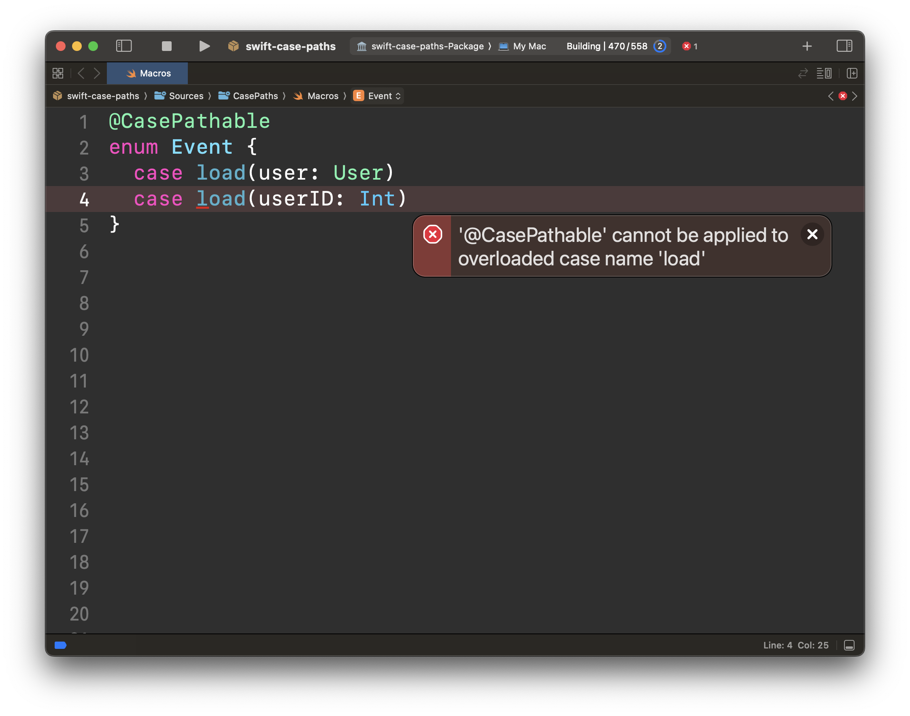

build-lists: true
theme: Olive Green, 2

# Testing Swift macros

^ ‼️🙋‍♂️ **STEPHEN**

^ Hello!

^ Macros are a wonderful new tool provided by Swift as of version 5.9 that can add all new super powers to your code.

^ Most people here have probably mostly interacted with macros by using ones already provided by Apple, such as the `@Observable` macro and `@Model` macro from SwiftData.

^ However, there will eventually come a time where you will finally want to write a macro yourself, but it can be quite difficult to do so correctly. Because macros are essentially little Swift programs that analyze existing Swift code in order to generate all new Swift code, it is easy to accidentally generate something invalid.

^ So, today we will be discussing how one tests macros to ensure that they work as expected over a variety of cases.

---

# 👋

## Brandon Williams
### [brandon@pointfree.co](#)

## Stephen Celis
### [stephen@pointfree.co](#)

^ ‼️🙋‍♂️ **BRANDON**

^ But first, we are Brandon and Stephen, and here is some contact info for everyone.

---

# Point-Free

### [www.pointfree.co](#)
### @pointfreeco


^ You may know of us from our website Point-Free, a weekly video series that covers advanced topics in the Swift programming language, such as what we are going to discuss here today. If you find today's talk interesting then you may also find our videos very interesting.

^ This is also the first ever joint presentation we have done at a conference, and it's been nearly 2 years since we've even been under the same roof at the same time, but let's begin…

---

# What is a macro?

^ We'll start with the basics. What is a macro?

^ Now we are not going to go in great detail about all the different flavor of macros, how they are used, or how to implement them. We are going to assume you know the basics and that you are familiar with some of the material from last year's WWDC.

^ In this talk we will mostly concentrate on the testing of macros. 

---
[.build-lists: false]

# What is a macro?

* A compiler plugin
  * Swift executable
  * `.macro` SPM target

^ So, we will just say that at a very high level, macros are compiler plugins—in fact they are executables—that are invoked as Swift is compiling your application's code. They are declared in the SPM Package.swift file, and they even have their own kind of target.

---

[.build-lists: false]

# How to use a macro?

* Attached to existing Swift code:

```swift
@Observable
class FeatureModel { … }
```

^ Macros can be applied in one of two ways.

^ They can be either attached directly to existing code, in which case an `@` symbol is used to indicate a macro.

^ Perhaps the most popular and most used macro in the Swift ecosystem is the `@Observable` macro, which enhances any class type with extra capabilities that allow any outside system to observe changes that happen inside the class.

---

[.build-lists: false]

# How to use a macro?

* Attached to existing Swift code:

```swift
@Observable
class FeatureModel { … }
```

* …or freestanding:

```swift
#Preview {
  FeatureView(…)
}
```

^ But also macros can be completely freestanding and not attached to any existing code.

^ In such cases the macro is prefixed with the `#` symbol.

--- 

# What does a macro do?

* Generates new Swift code

* Generates diagnostics and fix-its

* Applies more macros

^ And what can macros do?

^ Well, first and foremost a macro simply inserts more Swift code into your application that gets compiled right along the rest of your code.

^ But macros can also generate diagnostics, such as warnings and errors that are surfaced in Xcode, as well as "fix-its", which gives users a nice UI in Xcode for altering incorrect code into the correct format.

^ And finally, in the process of inserting Swift code, macros can apply more macros to your code, allowing the process to continue a few more times. However, macros cannot be recursively applied, so the process does always end at some point.

---

# Examples of macros

^ Let's quickly look at some examples of macros, starting with a few that Apple ships with Swift and platform SDKs.

---

```swift
import Observation

@Observable
class FeatureModel {
  var count = 0
}
```

^ First there's the `@Observable` macro that is part of the open source Swift project. You can go to GitHub right now and see how this macro is implemented.

---

[.code-highlight: all]
[.code-highlight: 6]
[.code-highlight: 7-18]
[.code-highlight: 19-28]
[.code-highlight: 30]
[.code-highlight: 1-4, 6, 29]
```swift
import Observation
 
@Observable
class FeatureModel {
  @ObservationTracked
  var count = 0
  {
    @storageRestrictions(initializes: _count)
    init(initialValue) { _count = initialValue }
    get {
      access(keyPath: \.count)
      return _count
    }
    set {
      withMutation(keyPath: \.count ) { _count = newValue }
    }
  }
  @ObservationIgnored private var _count  = 0
  @ObservationIgnored private let _$observationRegistrar = ObservationRegistrar()
  internal nonisolated func access<Member>(keyPath: KeyPath<FeatureModel, Member>) {
    _$observationRegistrar.access(self, keyPath: keyPath)
  }
  internal nonisolated func withMutation<Member, MutationResult>(
    keyPath: KeyPath<FeatureModel, Member>,
    _ mutation: () throws -> MutationResult
  ) rethrows -> MutationResult {
    try _$observationRegistrar.withMutation(of: self, keyPath: keyPath, mutation)
  }
}
extension FeatureModel: Observable {}
```

^ If we expand the macro in Xcode we will see everything it adds.

^ In essence it works by swapping out the stored property of `count` for a computed property and underscored stored property. this allows the class to tell the Observation framework whenever the property is accessed and mutated so that it can notify any listeners that changes have happened.

^ the macro also adds some other properties and methods

^ as well as extends the class to conform to the `Observable` protocol.

^ This is quite a bit of code that is generated for us by the macro. It would be a bummer if we had to maintain all of this code ourselves, and it pays off even more as the class becomes more complex.

---

```swift
import SwiftData

@Model
class FeatureModel {
  var count = 0
  init(count: Int = 0) {
    self.count = count
  }
}
```

^ Here's another example, the `@Model` macro from SwiftData.

---

[.code-highlight: all]
[.code-highlight: 5, 7-22, 26-41, 43, 44]
[.code-highlight: 1-4, 6, 23-25, 42]
```swift
import SwiftData
 
@Model
class FeatureModel {
  @_PersistedProperty
  var count = 0
  {
    @storageRestrictions(accesses: _$backingData, initializes: _count)
    init(initialValue) {
      _$backingData.setValue(forKey: \.count, to: initialValue)
      _count = _SwiftDataNoType()
    }
    get {
      _$observationRegistrar.access(self, keyPath: \.count)
      return self.getValue(forKey: \.count)
    }
    set {
      _$observationRegistrar.withMutation(of: self, keyPath: \.count) { self.setValue(forKey: \.count, to: newValue) }
    }
  }
  @Transient
  private var _count: _SwiftDataNoType = _SwiftDataNoType()
  init(count: Int = 0) {
    self.count = count
  }
  @Transient
  private var _$backingData: any BackingData<FeatureModel> = FeatureModel.createBackingData()
  public var persistentBackingData: any BackingData<FeatureModel> {
    get { _$backingData }
    set { _$backingData = newValue }
  }
  static var schemaMetadata: [Schema.PropertyMetadata] {
    return [Schema.PropertyMetadata(name: "count", keypath: \FeatureModel.count, defaultValue: 0, metadata: nil)]
  }
  required init(backingData: any BackingData<FeatureModel>) {
    _count = _SwiftDataNoType()
    self.persistentBackingData = backingData
  }
  @Transient
  private let _$observationRegistrar = ObservationRegistrar()
  struct _SwiftDataNoType {}
}
extension FeatureModel: PersistentModel {}
extension FeatureModel: Observable {}
```

^ When expanded you get this, which is even more code that the `@Observable` macro. 

^ We can even highlight only the code expanded by the macro and we will see it's the vast majority of the code in the class now.

^ We would of course never want to write all of this code, but allowing a macro to generate it for us automatically gives us all kinds of super powers with SwiftData.

---

```swift
import CasePaths

@CasePathable
enum Event {
  case empty
  case response(User)
  case loading(percent: Double)
  case error(Error)
}
```

^ Here's another example, this time from one of our libraries. We maintain a popular library called "CasePaths", which allows one to use key path syntax for enums and their cases.

^ By applying the `@CasePathable` macro you get key paths generated for each case, and you can use those key paths for all types of interesting things. But that isn't important, what's important right now is what code is generated by this macro…

---

[.code-highlight: all]
[.code-highlight: 10-48, 50]
[.code-highlight: 1-9, 49]
```swift
import CasePaths

@CasePathable
enum Event {
  case empty
  case response(User)
  case loading(percent: Double)
  case error(Error)

  public struct AllCasePaths {
    public var empty: CasePaths.AnyCasePath<Event, Void> {
      CasePaths.AnyCasePath<Event, Void>(
        embed: { Event.empty },
        extract: {
          guard case .empty = $0 else { return nil }
          return ()
        }
      )
    }
    public var response: CasePaths.AnyCasePath<Event, User> {
      CasePaths.AnyCasePath<Event, User>(
        embed: Event.response,
        extract: {
          guard case let .response(v0) = $0 else { return nil }
          return v0
        }
      )
    }
    public var loading: CasePaths.AnyCasePath<Event, Double> {
      CasePaths.AnyCasePath<Event, Double>(
        embed: Event.loading,
        extract: {
          guard case let .loading(v0) = $0 else { return nil }
          return v0
        }
      )
    }
    public var error: CasePaths.AnyCasePath<Event, Error> {
      CasePaths.AnyCasePath<Event, Error>(
        embed: Event.error,
        extract: {
          guard case let .error(v0) = $0 else { return nil }
          return v0
        }
      )
    }
  }
  public static var allCasePaths: AllCasePaths { AllCasePaths() }
}
extension Event: CasePaths.CasePathable {}
```

^ …which is all of this. Each case of the enum becomes a computed property on an inner type that is added by the macro. That is what gives us key path syntax for each case of the enum.

---


^ Also the macro performs a bit of validation in order to make sure you are using it correctly. For example, it does not make sense to apply the `@CasePathable` macro to a struct, since structs already get key paths for their properties, and so the macro will emit an error if you try to do so.

---

```swift
import DependenciesMacros

@DependencyClient
struct APIClient {
  var fetchUser: (Int) async throws -> User
  var saveUser: (User) async throws -> Void
}
```

^ Here's one last macro, also from one of our libraries. This is in our dependency injection library, and it generates some boilerplate associated with defining dependency interfaces in your application. The details aren't important though, what is important is what code is generated…

---

[.code-highlight: all]
[.code-highlight: 5, 7-23, 25-49]
[.code-highlight: 1-4, 6, 24, 50]
```swift
import DependenciesMacros

@DependencyClient
struct APIClient {
  @DependencyEndpoint
  var fetchUser: (Int) async throws -> User
  {
    @storageRestrictions(initializes: _fetchUser)
    init(initialValue) {
      _fetchUser = initialValue
    }
    get {
      _fetchUser
    }
    set {
      _fetchUser = newValue
    }
  }
  private var _fetchUser: (Int) async throws -> User = { _ in
    XCTestDynamicOverlay.XCTFail("Unimplemented: 'fetchUser'")
    throw DependenciesMacros.Unimplemented("fetchUser")
  }
  @DependencyEndpoint
  var saveUser: (User) async throws -> Void
  {
    @storageRestrictions(initializes: _saveUser)
    init(initialValue) {
      _saveUser = initialValue
    }
    get {
      _saveUser
    }
    set {
      _saveUser = newValue
    }
  }
  private var _saveUser: (User) async throws -> Void = { _ in
    XCTestDynamicOverlay.XCTFail("Unimplemented: 'saveUser'")
    throw DependenciesMacros.Unimplemented("saveUser")
  }
  init(
    fetchUser: @escaping (Int) async throws -> User,
    saveUser: @escaping (User) async throws -> Void
  ) {
    self.fetchUser = fetchUser
    self.saveUser = saveUser
  }
  init() {
  }
}
```

^ …which is all of this code. Again this is a ton of code being generated that we never have to worry about. And as our `APIClient` gets more complex and has more endpoints, the code generated will also become much bigger.

---


^ The macro also emits a diagnostic with a fix-it.

^ If one of your dependency endpoints doesn't have any type information supplied, then an error is emitted with a fix-it.

---


^ And if you apply the fix-it a type annotation placeholder will be inserted into the code letting you know exactly what needs to be done.

---

# A lot can go wrong when expanding macro code

^ ‼️🙋‍♂️ **STEPHEN**

^ So we now see that macros can generate a lot of code for us so that we can concentrate on our core domain without worrying about a bunch of boilerplate.

^ That's great.

^ But the downside is that the more code we generate with a macro the more things that can go wrong. And it is very, _very_ easy for something to go wrong when implementing a macro.

---

# Stored vs computed properties

```swift
@Observable
class FeatureModel {
  var count = 0
  var isEven: Bool { count.isMultiple(of: 2) }
}
```

^ For example, the `@Observable` macro needs to be careful to only transform _stored_ properties of the class, and leave _computed_ properties alone. If it tries to expand additional code for the `isEven` property it will generate invalid Swift code.

---

# `let` vs `var`

```swift
@Observable
class FeatureModel {
  let id = UUID()
  var count = 0
}
```

^ Extra care also has to be taken with `let` versus `var` properties. If a property is bound with `let` then no observation instrumentation needs to take place, and in fact trying to add `get` and `set` accessors to such a property is invalid Swift code.

---

# Access control

```swift
@Model
class FeatureModel {
  …
  var persistentBackingData { … }
  static var schemaMetadata { … }
  required init(backingData:) { … }
}
extension FeatureModel: PersistentModel {}
```

^ Access control can also be tricky. For example, the `@Model` macro automatically conforms a class to the `PersistentModel` protocol, which has a few requirements that the macro expands, and it must take care to bring along the access control applied to the class to these requirements. If it doesn't, a public class would have incompatible access control on its protocol requirements, causing compiler errors.

---

# Access control

[.code-highlight: 2, 4-6]
```swift
@Model
public class FeatureModel {
  …
  public var persistentBackingData { … }
  public static var schemaMetadata { … }
  public required init(backingData:) { … }
}
extension FeatureModel: PersistentModel {}
```

^ In general one should consider access control to ensure that a macro can be applied to all kinds of public, private, internal, and package-level code.

---

### Overloaded enum case names



^ There are also situations in which a macro cannot possibly generate valid Swift code based on the code it is applied to.

^ For example, it is technically possible to overload case names in Swift enums. However, overloaded case names aren't useful at all in Swift due to a Swift compiler bug that makes it impossible to switch over such enums.

^ Further, overloaded case names would cause our `@CasePathable` macro to generate invalid Swift since it would need to generate two computed properties with the same name.

^ So, we detect that situation early on and emit an error immediately. That way we don't generate invalid Swift code.

---

# Compiler directives

```swift
@MemberwiseInitializer
struct User {
  let id: UUID
  var name: String
  #if DEBUG
    var debugFlag = false
  #endif
}
```

^ Another thorny situation is when compiler directives are involved.

^ A very popular case study for macros is a "memberwise initializer" macro, which generates a public initializer for each field of a struct.

^ But if some of those fields are hidden behind a compiler directive, like `#if DEBUG`, then you have to take extra care with how the initializers are generated. It is very easy to get this wrong.

---

# Compiler directives

```swift
#if canImport(AppKit)
  import AppKit
#else
  import UIKit
#endif

@CasePathable
enum Event {
  #if canImport(AppKit)
    case open(NSApplication)
  #else
    case open(UIApplication)
  #endif
  case close
}
```

^ And this is something we came across in our case paths library.

^ There were people using our library that needed enums which had different cases on different platforms. We needed to create computed properties for each of these cases while also repeating the compiler directives.

---

# Compiler directives

```swift
#if canImport(AppKit)
  import AppKit
#else
  import UIKit
#endif

@CasePathable
enum Event {
  #if canImport(AppKit) && DEBUG
    case open(NSApplication)
  #else
    #if swift(>=5.9)
      case open(UIApplication)
    #endif
  #endif
  case close
}
```

^ And of course things can get really complicated when you have multiple conditions in a directive, or nested directives.

---

# How to test macros?

^ ‼️🙋‍♂️ **BRANDON**

^ This is only a small taste of all the complexities one has to think about when writing a macro.

^ Swift syntax can be quirky, and that puts a lot of responsibility on our shoulders to make sure we deal with its quirkiness in the right way.

--- 

# Apple's method of testing macros

^ First let's quickly show off the tool that Apple provides for testing macros. 

^ Honestly we are all lucky that Apple even provided such a tool! Many times Apple's SDKs and libraries are not built with testing in mind, and that makes it very difficult to verify that something works the way you expect in an automated way.

---

```swift
func testMyMacro() {
  assertMacroExpansion(
    <#String#>, 
    expandedSource: <#String#>, 
    macros: <#[String : Macro]#>
  )
}
```

^ The tool Apple gave us is this free function called `assertMacroExpansion`.

^ It takes 3 arguments. The first is a string that represents a bit of Swift code that uses macros in it.

^ The second argument is a string that represents the Swift code after any macros have been expanded.

^ And the third argument is a list of the macros that you are testing. 

^ When the test is run, the `assertMacroExpansion` function will expand all the macros in the first string, and then compare that to the second string you provided. If it does not match the test will fail with a helpful error message.

---

# Live demo of `assertMacroExpansion`

^ Let's check out how this works live in Xcode!

^ ‼️🙋‍♂️ **Note to interpreters:** This portion will be done while we live code on the screen. The below transcript is _roughly_ what we will discuss.

^ We have our "Case Paths" library open right now, and we have a fresh test file prepared where we can write a new test.

^ Let's write a simple test for the `@CasePathable` macro that is applied to an enum with one case.

^ We get a test failure that shows exactly what went wrong. In fact, we can see the full expansion right in the failure message.

^ The question is, how do we turn this into a passing test?

^ Well, we can just copy the expected string straight from the failure message and paste it into the `expandedSource` argument. However, due to a bug in Xcode you can't always scroll down to the bottom of the failure message, and so sometimes that can be difficult to do.

^ But even if you do the copy-and-paste, the test still fails. And that's because there are slight changes to the formatting. Looks like when pasting we lost some indentation.

^ The easiest way to fix is to delete the `expandedSource` and try again. This time we will be un-indented all the way to the beginning of the line, and we will perform command+option+shift+V to paste in the code while preserving formatting.

^ Now the test passes, but it's also weird that it's indented so far to the left. If we don't like that we will have to re-indent to the right.

^ But, at least we have a passing test. Well, that is until we change the input source a bit. Let's add another case.

^ Now we have another test failure, and we have to go through the laborious steps to fix it.

^ Let's make another change to the input string to produce a diagnostic, such as the overloaded case name we demonstrated a moment ago.

^ Now we again have a test failure, which we can fix by copying and pasting the string again. This shows that the macro doesn't expand anything when it finds a problem with the case names.

^ But even that is not enough to get a passing test because we also have to assert on the diagnostics produced. To do that we need to provide an extra argument to `assertMacroExpansion` and describe all the details of the diagnostic, including the message, line and column it appeared. But even with that done, this diagnostic isn't super helpful. It tells us abstractly that the problem is on line 4 and column 8, but I would have to do a bunch of counting to actually see where the corresponds in the Swift code.

---

# `assertMacroExpansion`

^ We finally have a passing test, but it was a bit painful to maintain this expanded source. And if we make small changes to our macro then it will be easy to get another test failure here, and we will have to repeat all of these steps again to get the test passing.

^ So, that is how Apple's test helper works. Again, it is nice that Apple provided something, but the ergonomics are just not quite there. It can be difficult to manually maintain the `expandedSource` string in tests, and diagnostics are really hard to maintain.

---

# A better macro testing helper

github.com/pointfreeco/swift-macro-testing

^ ‼️🙋‍♂️ **STEPHEN**

^ And this is what motivated us to create our own macro testing library.

^ It is called swift-macro-testing and surprisingly it is actually built on top of our popular snapshot testing library. If you didn't already know, we have a snapshot testing library that allows you to snapshot any kind of data type into any kind of format, not just snapshotting views into images.

^ And it's even able to inline snapshot data types into strings, and insert those strings directly into the test source file. We call this inline snapshot testing.

---

# Live demo of `assertMacro`

^ Let's demo how our macro testing helper can improve upon Apple's default testing helper.

^ ‼️🙋‍♂️ **Note to interpreters:** This portion will be done while we live code on the screen. The below transcript is _roughly_ what we will discuss.

^ I am going to create a new test method, and use our `assertMacro` helper. It can be used by providing just a single argument: a trailing closure of a string that represents the input Swift source code that you want to expand.

^ And thanks to the `withMacroTesting` up at the top of the file, we have one single place where the macro is described rather than needing to add it to every invocation of the helper.

^ If we run this test we will see that magically the expanded macro source was inserted right into our test file. We didn't need to copy-and-paste from a test failure message, and we didn't need to reformat the string. It all was done for us.

^ We can verify this string to see that it is what we expect it to be, and if we re-run the test it passes.

^ Further, if we tweak the input string a bit we get a test failure with a very helpful message of exactly what went wrong. However, we can re-record this expand macro source by simply turning on record mode.

^ Now when we run the test the fresh macro expansion is written into the test file. And now we can turn off record mode.

^ But things get even better. Let's test the diagnostics.

^ Let's add back an overloaded case name, put the test in record mode again, and re-run the test. A new `diagnostics` closure was automatically inserted into the test. This shows exactly where the diagnostic was emitted inline, at the line, column and even range.

---

# `assertMacro`

^ That is the basics of how to test a macro using our `assertMacro` helper. It's pretty great, but also what we have shown here is only scratching the surface. There are a lot more things it can do. If you are writing macros we highly encourage you give it a spin to test your macros.

---

# Static macro tests

^ todo: we can cut this if we need to save time

---

# Lessons learned from writing _lots_ of macros

^ ‼️🙋‍♂️ **BRANDON**

^ And finally we want to end by sharing some lessons we've learned, often the _hard_ way, by having written many, many, many macros.

---

# Lessons learned from writing _lots_ of macros

```swift
@CasePathable
@DependencyClient
@DependencyEndpoint
@ObservableState
@Perceptible
@Presents
@Reducer
@ViewAction
```

^ And let us tell you, we have written quite a few macros. And each one of these has come with its own unique challenges, and so we would like to steer you in the right direction for when you start writing your own macros,

---

# Better for your macro to generate errors than bad Swift code

^ Our first lesson to keep in mind is that it is far, far better for your macro to emit a diagnostic than to rely on Xcode emitting one for you.

^ If your macro generates code that has an error or a warning in it, then Xcode will unfortunately not display it right in the editor where you would hope.

^ Instead you have to go to the issue or report navigator in Xcode, select the failure or the build that failed, and sometimes even sift through a bunch of cryptic logs manually to find the true problem. That is a really bad experience for the users of your macro.

^ So, we recommend that you do as much work as possible to detect problems in the code your macro will expand, and emit diagnostics for those problems yourself rather than relying on Xcode.

---

### Better to surface errors than generate bad Swift code
# _Also surface sub-macro errors in the parent!_ 

^ However, there is a caveat to the previous rule.

^ If your macro applies new macros, and _those_ macros generate diagnostics, the Swift compiler will crash when they do. It is a very unfortunate bug in the Swift compiler.

^ So if you want to truly provide the best experience for users of your macro you have to go the extra mile and have the _parent_ macro detect any problems that the _child_ macro may come across, and emit those errors.

^ It's a HUGE bummer that we have to do this, but it really makes a huge difference in the kind of experience users will have with your macro.

---

# Write _lots_ of tests 

^ ‼️🙋‍♂️ **STEPHEN**

^ Our next lesson for you to consider is to write lots and lots of tests. Thanks to our swift-macro-testing library it is very easy to write tests, and so we recommend writing many for every little edge case and Swift quirk you can think of.

---

# Exercise many Swift features

^ ‼️🙋‍♂️ **BRANDON**

* Access control
* `@available`
* `#if`/`#elseif`/`#else`
* Overloaded case names
* Closures with named arguments
* …

^ And we discussed a lot of the complexities of Swift syntax during this presentation.

^ You need to make sure to handle things like access control, availability annotations, and compiler directives correctly.

^ Also if your macro deals with enums you might need to deal with the fact that enum cases can be overloaded

^ And there are some "fun" quirks to named arguments in Swift. For example, closure arguments can't be provided external argument names, but they can provide internal names. And you may have to take that into account.

<!-- ---

# Protocol requirements and access control

```swift
public extension Feature {
  @Reducer
  enum Destination {
    // ...
  }
}
```

^ This is a very specific lesson, but I'm sure some of y'all will run into this eventually.

^ If your macro generates the protocol requirements for a public protocol, then you should just make 

 If your macro generates requirements for a public protocol

^ if macro generates requirements for a public protocol, always make the members public. -->

---

# Report bugs to Apple

^ ‼️🙋‍♂️ **STEPHEN**

Include a complete project with the most minimal amount of code possible that demonstrates the problem.

^ And finally, when you come across a bug with macros, and you almost certainly will, then please file a bug with Apple. Since most macro bugs are in the Swift compiler you can file them in the GitHub issues.

^ You only need to file a Feedback if the bug involves Xcode too.

^ Also, to increase the chances of someone actually looking at the bug please provide a complete project that demonstrates the bug, and include the absolute minimum amount of code possible. This makes it very easy for someone at Apple to reproduce the problem and figure out how to triage the problem.

---

# Thanks!

## Brandon Williams
### brandon@pointfree.co

## Stephen Celis
### stephen@pointfree.co


^ That's all we have for today. Thanks!
